# Draft Implementasi Sistem E-Kos

Dokumen ini berisi rancangan detail implementasi sistem manajemen kos dengan integrasi pengingat otomatis berbasis _chatbot_.

Sistem ini dirancang dengan pendekatan yang mudah dipahami, berfokus pada keterbacaan struktur, dan menggunakan terminologi umum untuk mempermudah proses pengembangan selanjutnya.

---

## 1. Rancangan Model Sistem

Sistem melibatkan 3 aktor utama:

1. **Admin**: Bertanggung jawab secara independen untuk manajemen akun admin/staf dan kamar.
2. **Staff**: Mengelola operasional harian kos (manajemen kamar, manajemen penghuni, pengaturan pengingat, dan melihat laporan transaksi) melalui antarmuka web.
3. **Penghuni**: Berinteraksi dengan sistem sepenuhnya melalui fasilitas _chatbot_ (menerima pengingat tagihan, mengecek tagihan, melihat riwayat pembayaran, membayar tagihan, dan mengajukan komplain).

### 1.1 Diagram Konteks

Menggambarkan interaksi tingkat tinggi antara aktor dengan sistem e-kos.

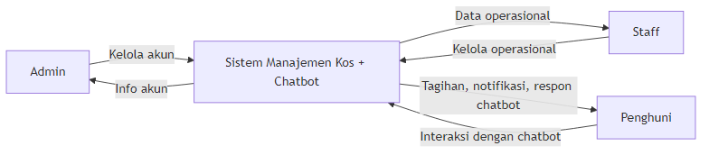

_Penjelasan: Diagram ini memberikan gambaran umum mengenai pihak-pihak utama yang berinteraksi dengan sistem manajemen kos digital. Admin dan Staf berperan sebagai pengelola yang menangani operasional administratif, sementara Penghuni menggunakan aplikasi pesan singkat untuk berinteraksi dengan sistem secara praktis._

### 1.2 Use Case Diagram

Rancangan aktor dan pembagian interaksi dalam e-kos.

_Penjelasan:
Diagram use case berikut menggambarkan interaksi logis antara penyewa, pemilik/pengelola kos, dan sistem pembayaran digital dalam mengelola pembayaran sewa kos. Sistem ini dirancang untuk mengotomatisasi pembayaran sewa, pengiriman notifikasi, dan pelacakan transaksi, sehingga mengurangi kesalahan manual maupun keterlambatan pembayaran. Aktor dalam sistem terbagi menjadi:
- **Admin**: Pemegang kendali utama yang mendaftarkan aset kamar serta mengelola data manajemen staf.
- **Staff**: Pengelola asrama sehari-hari yang berperan memantau status pembayaran melalui _dashboard_ real-time serta menghasilkan luaran laporan keuangan.
- **Penghuni**: Penyewa yang dapat melakukan pengecekan tagihan, memproses transaksi digital, menerima notifikasi pengingat secara otomatis, serta menyampaikan komplain kerusakan._

### 1.3 Diagram Aktivitas (Activity Diagrams)

<b>Aktivitas Verifikasi (Login)</b>
 

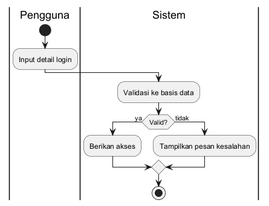

_Penjelasan: Menggambarkan proses awal saat pengelola melakukan autentikasi sistem. Setelah proses input kredensial, validasi di basis data sistem berjalan untuk membatasi izin akses keamanan._

<b>Aktivitas Manajemen Akun User</b>
 

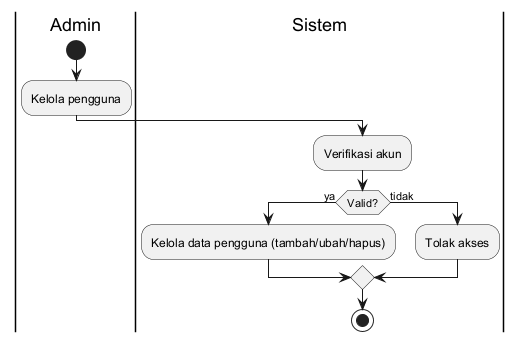

_Penjelasan: Alur pendataan pengguna internal oleh Admin. Ini memastikan hanya sumber daya manusia berwenang yang dapat mengakses log transaksi kos._

<b>Aktivitas Manajemen Kamar</b>
 

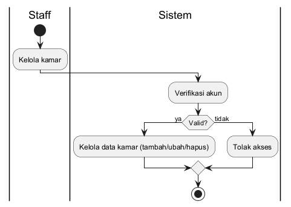

_Penjelasan: Proses ini mempresentasikan pencatatan nomor unit, harga bulanan, dan ketersediaan, mendigitalisasikan manajemen hunian yang menekan error catatan manual._

<b>Aktivitas Manajemen Penghuni</b>
 

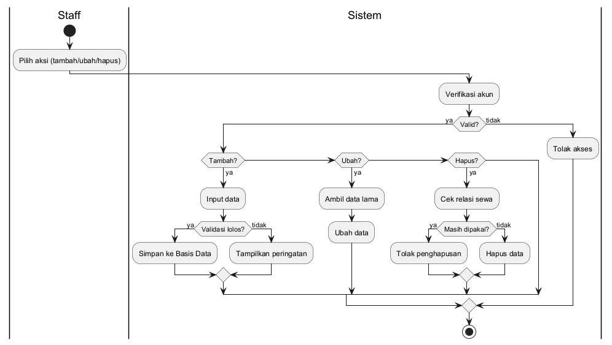

_Penjelasan: Activity Diagram pendaftaran kontrak penyewaan. Mengaitkan profil biodata individu dengan entitas unit kamar untuk pengarsipan riwayat penyewaan berbasis sistem._

<b>Aktivitas Lihat Laporan Transaksi</b>
 

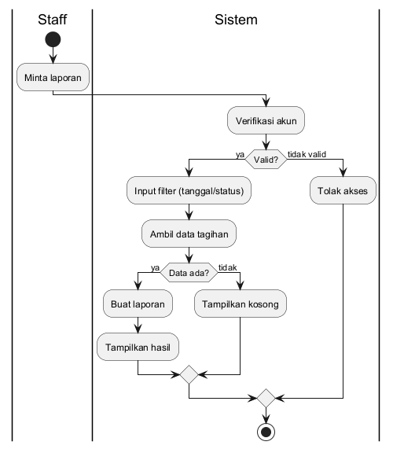

_Penjelasan: Menjelaskan proses yang dilakukan pengelola untuk mengekstrak data transaksi dan menghasilkan laporan keuangan berkala format utuh guna mendukung dokumentasi secara formal._

<b>Aktivitas Chatbot Penghuni</b>
 

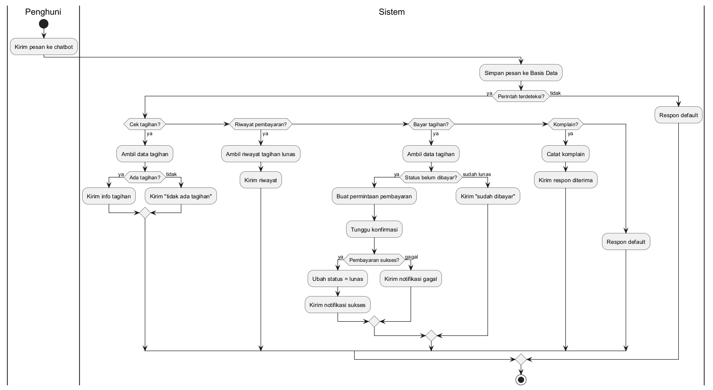

_Penjelasan: Menggambarkan alur eksekusi pesan pintar antara penyewa dengan asisten bot dalam mencari info maupun pendaftaran log komplain fasilitas kos._

<b>Aktivitas Pembayaran (Payment Gateway)</b>
 

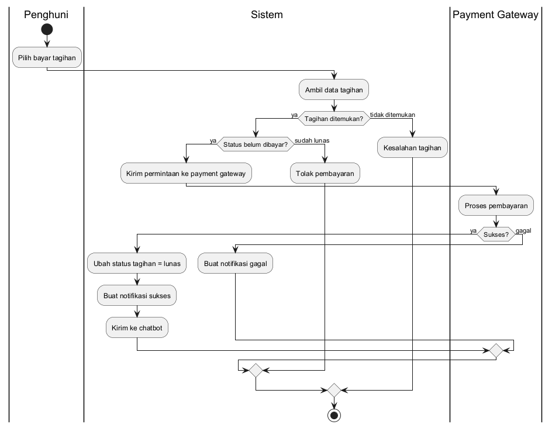

_Penjelasan: Menggambarkan proses pembayaran sewa oleh peyewa ke sistem. Sistem akan mengirim permintaan ke payment gateway untuk memproses dan memverifikasi interaksi perbankan digital. Proses ini penting untuk integritas validasi otomatis._

<b>Aktivitas Scheduler Pengingat</b>
 

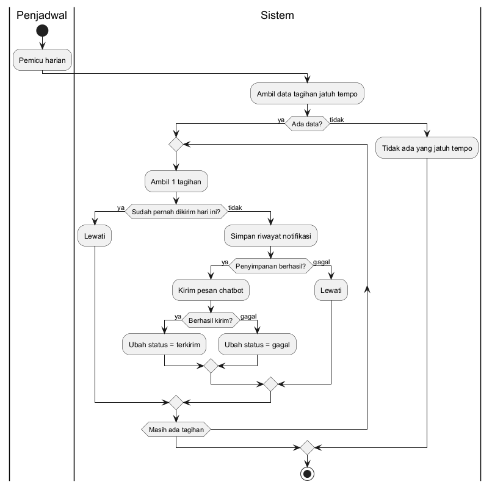

_Penjelasan: Proses otomatis mesin (cron) yang mengonfigurasi pengiriman pengingat berjenjang kepada penyewa yang menunggak secara proaktif berdasarkan data tanggal jatuh tempo._

<b>Aktivitas Lihat Komplain</b>
 

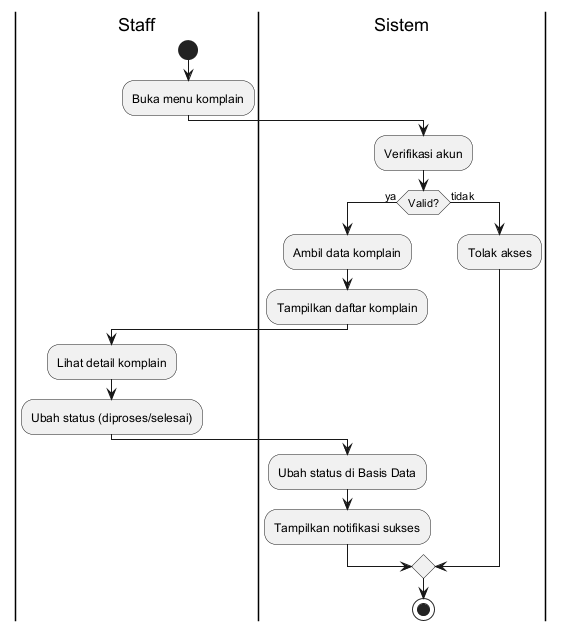

_Penjelasan: Alur pembaharuan aduan. Ini berfungsi mengonversi keluhan lisan penyewa via bot menjadi tumpukan laporan insiden berbasis form data yang aman ditindak lanjuti._

### 1.4 Diagram Urutan (Sequence Diagrams)

<b>Urutan Verifikasi</b>
 

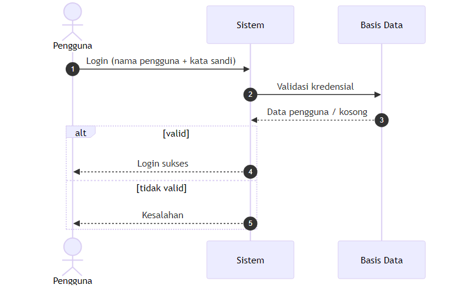

_Penjelasan: Rangkaian komunikasi logis antar lapisan program saat pengecekan basis data username atau sandi staf di eksekusi._

<b>Urutan Kelola User</b>
 

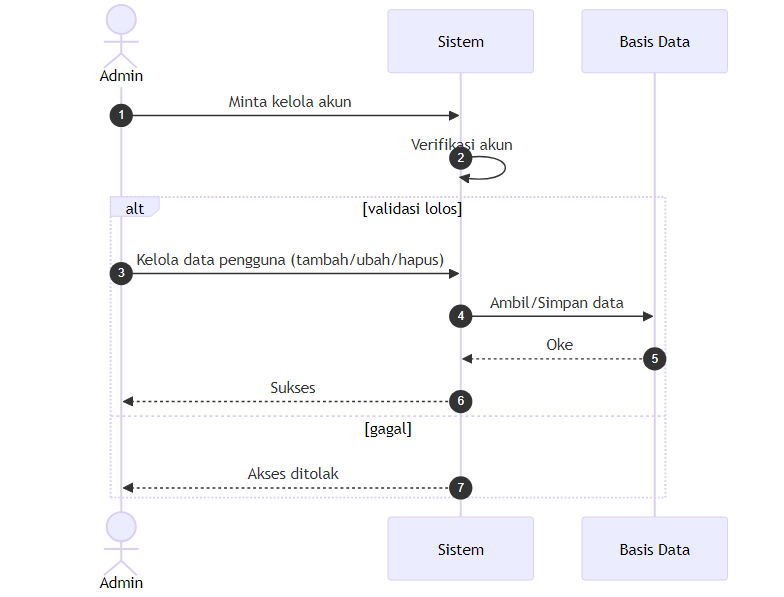

_Penjelasan: Relasi operasional pesan sistem mengenai pembentukan maupun modifikasi rekaman administrator kos._

<b>Urutan Kelola Kamar</b>
 

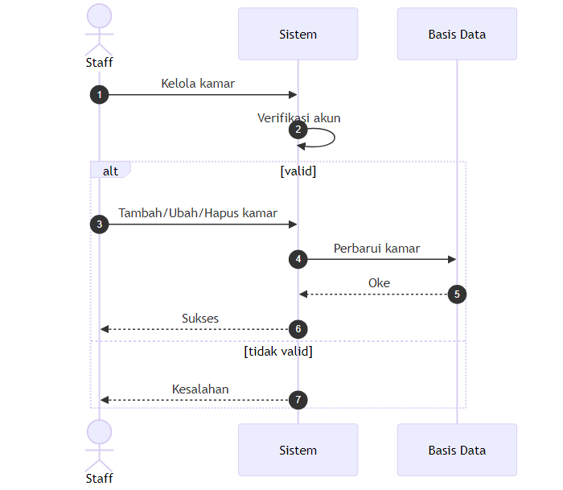

_Penjelasan: Pola lintas perintah terstruktur ketika harga dan unit ruangan dikonfigurasikan di sistem database._

<b>Urutan Kelola Penghuni</b>
 

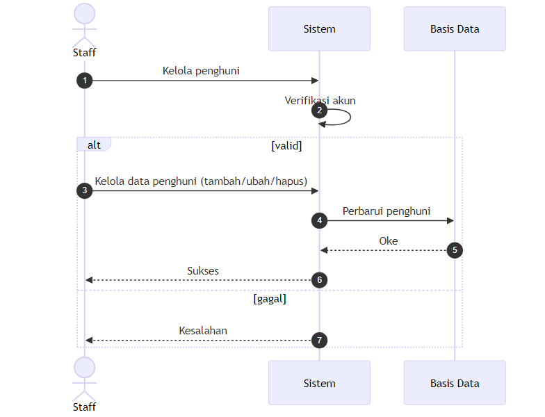

_Penjelasan: Transformasi langkah saat menyinkronisasi data penghuni dengan tanggal sewa persilangan kamar._

<b>Urutan Laporan Transaksi</b>
 

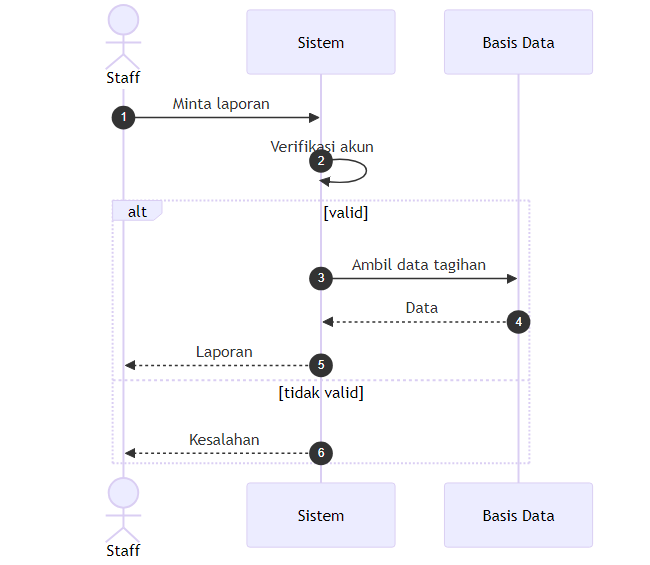

_Penjelasan: Menyajikan komunikasi sistem untuk melakukan penyaringan tanggal pada riwayat transaksi demi laporan mutasi._

<b>Urutan Chatbot</b>
 

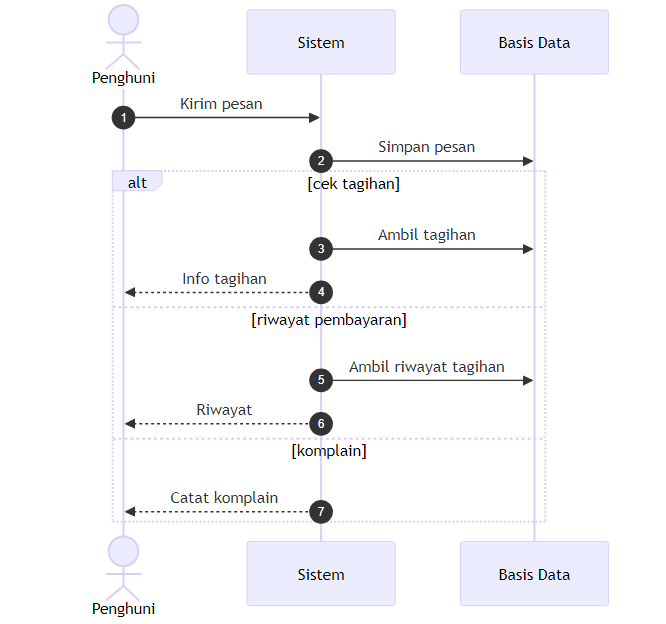

_Penjelasan: Sekuens perantara server otomatis ketika pesan masuk penghuni dicocokkan dengan kueri tabel yang relevan._

<b>Urutan Pembayaran</b>
 

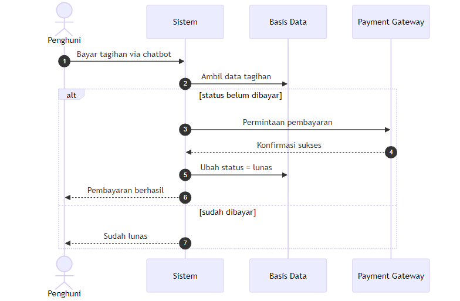

_Penjelasan: Tahapan sistem mengirimkan tagihan pada webhook perbankan luar (Midtrans) beserta interupsi kembali ketika dana masuk diproses._

<b>Urutan Penjadwal (Scheduler)</b>
 

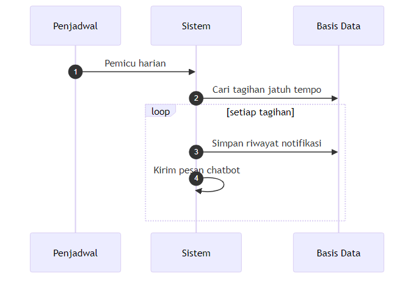

_Penjelasan: Rutinitas sinkron jadwal pemicu lonceng pengingat yang menyaring piutang jatuh tempo via penyedia pesan gateway._

<b>Urutan Lihat Komplain</b>
 

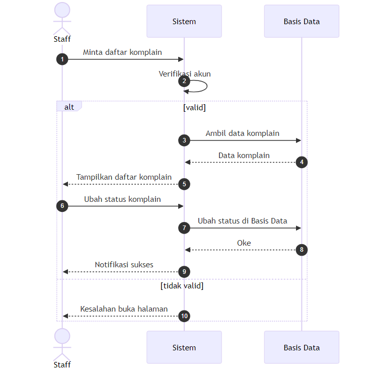

_Penjelasan: Progres aliran objek dalam proses penanganan kasus komplain oleh pihak manajerial berbasis resolusi tiket perbaikan._

### 1.5 Class Diagram

Struktur relasi data utama sistem.

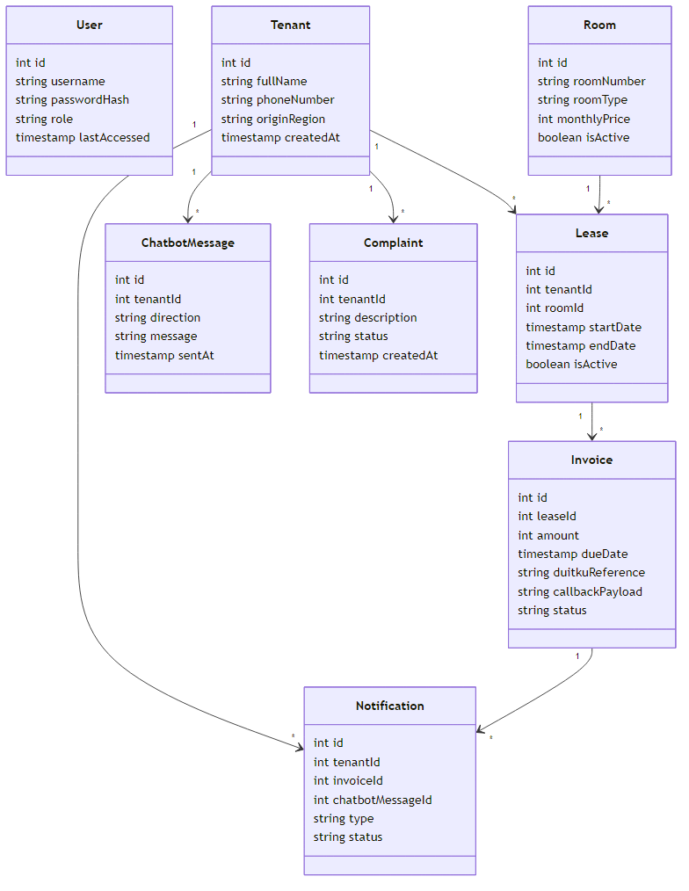

_Penjelasan: Mempresentasikan desain statis berorientasi objek basis data manajemen sewa. Entitas Penyewa, Kamar, dan Masa Sewa menciptakan rekam jejak Tagihan yang presisi beserta aliran Komplain yang terdokumentasi rapi demi mengurangi potensi sengketa arsip riwayat._

---

## 2. Rancangan Basis Data

Dirancang mengikuti skema referensi pada `packages/database/src/schema.ts`.

### `users`

Data autentikasi admin/staff

| Nama Kolom      | Tipe Data        | Keterangan                        |
| --------------- | ---------------- | --------------------------------- |
| `id`            | INTEGER (PK, AI) | ID pengguna.                      |
| `username`      | TEXT (Unique)    | Nama pengguna untuk masuk sistem. |
| `password_hash` | TEXT             | Kata sandi akun.                  |
| `role`          | TEXT             | Role akun (admin/staff).          |
| `last_accessed` | TIMESTAMP        | Kapan terakhir kali akun diakses. |

### `tenants`

Pusat data penghuni kos

| Nama Kolom      | Tipe Data        | Keterangan                             |
| --------------- | ---------------- | -------------------------------------- |
| `id`            | INTEGER (PK, AI) | ID penghuni.                           |
| `full_name`     | TEXT             | Nama lengkap penghuni.                 |
| `phone_number`  | TEXT (Unique)    | Nomor kontak untuk obrolan bot.        |
| `origin_region` | TEXT NULL        | Daerah kediaman asal penghuni.         |
| `created_at`    | TIMESTAMP        | Waktu pertama kali didata sistem.      |

### `rooms`

Pusat data inventaris spesifik kamar

| Nama Kolom      | Tipe Data        | Keterangan                                |
| --------------- | ---------------- | ----------------------------------------- |
| `id`            | INTEGER (PK, AI) | ID kamar.                                 |
| `room_number`   | TEXT (Unique)    | Nomor di pintu kamar.                     |
| `room_type`     | TEXT NULL        | Jenis kamar.                              |
| `monthly_price` | INTEGER          | Harga sewa setiap bulannya.               |
| `is_active`     | BOOLEAN          | Penentu apakah kamar tersedia atau tidak. |

### `leases`

Manajemen status persewaan

| Nama Kolom   | Tipe Data        | Keterangan                                        |
| ------------ | ---------------- | ------------------------------------------------- |
| `id`         | INTEGER (PK, AI) | ID kontrak penyewaan.                             |
| `tenant_id`  | INTEGER (FK)     | Penghuni yang menyewa kamarnya.                   |
| `room_id`    | INTEGER (FK)     | Kamar mana yang mereka tempati.                   |
| `start_date` | TIMESTAMP        | Tanggal mulainya sewa ini resmi dihitung.         |
| `end_date`   | TIMESTAMP        | Tanggal berakhirnya masa penyewaan.               |
| `is_active`  | BOOLEAN          | Penanda apakah penyewa ini masih tinggal di sana. |

### `invoices`

Pencatatan tagihan per masa sewa

| Nama Kolom         | Tipe Data        | Keterangan                                    |
| ------------------ | ---------------- | --------------------------------------------- |
| `id`               | INTEGER (PK, AI) | ID lembar tagihan.                            |
| `lease_id`         | INTEGER (FK)     | Data sewa yang sedang ditagihkan ke penghuni. |
| `amount`           | INTEGER          | Nominal uang yang wajib dibayar.              |
| `due_date`         | TIMESTAMP        | Tanggal batas akhir setor uang.               |
| `duitku_reference` | TEXT NULL        | Kode resi payment gateway (DUITKU).           |
| `callback_payload` | TEXT NULL        | Payload raw hasil callback payment gateway.   |
| `status`           | TEXT             | Status pelunasan.                             |

### `chatbot_messages`

Riwayat aliran komunikasi bot

| Nama Kolom  | Tipe Data        | Keterangan                            |
| ----------- | ---------------- | ------------------------------------- |
| `id`        | INTEGER (PK, AI) | ID log pesan berjalan.                |
| `tenant_id` | INTEGER (FK)     | Penghuni yang sedang memakai chatbot. |
| `direction` | TEXT             | Konteks pesan dikirim/diterima.       |
| `message`   | TEXT             | Isi tulisan pesannya.                 |
| `sent_at`   | TIMESTAMP        | Waktu kapan pesan dikirim.            |

### `notifications`

Catatan historis pengingat/sistem

| Nama Kolom           | Tipe Data            | Keterangan                         |
| -------------------- | -------------------- | ---------------------------------- |
| `id`                 | INTEGER (PK, AI)     | ID pesan pemberitahuan.            |
| `tenant_id`          | INTEGER (FK)         | Penghuni yang dikirimi notifikasi. |
| `invoice_id`         | INTEGER (FK)         | Tagihan yang terkait.              |
| `chatbot_message_id` | INTEGER (Unique, FK) | Pesan yang dikirimkan.             |
| `type`               | TEXT                 | Konteks pengingat.                 |
| `status`             | TEXT                 | Status pengiriman notifikasi.      |

### `audit_logs`

Laporan setiap aksi rekam jejak sistem

| Nama Kolom   | Tipe Data        | Keterangan                            |
| ------------ | ---------------- | ------------------------------------- |
| `id`         | INTEGER (PK, AI) | ID rekam jejak perubahan sistem.      |
| `user_id`    | INTEGER (FK)     | Pengguna yang mengubah datanya.       |
| `action`     | TEXT             | Aksi perubahannya.                    |
| `table_name` | TEXT             | Tabel yang dirubah.                   |
| `record_id`  | INTEGER          | ID dari record yang dirubah.          |
| `created_at` | TIMESTAMP        | Waktu tindakan mengubah hal tersebut. |

### `complaints`

Data laporan dan keluhan dari penghuni

| Nama Kolom    | Tipe Data        | Keterangan                    |
| ------------- | ---------------- | ----------------------------- |
| `id`          | INTEGER (PK, AI) | ID surat pengaduan.           |
| `tenant_id`   | INTEGER (FK)     | Penghuni pelapor.             |
| `description` | TEXT             | Isi detail dari kerusakannya. |
| `status`      | TEXT             | Status keluhan ini.           |
| `created_at`  | TIMESTAMP        | Waktu keluhan dibuat.         |
