# Draft Implementasi Sistem E-Kos

Dokumen ini berisi rancangan detail implementasi sistem manajemen kos dengan integrasi pengingat otomatis berbasis _chatbot_.

Sistem ini dirancang dengan pendekatan yang mudah dipahami, berfokus pada keterbacaan struktur, dan menggunakan terminologi umum untuk mempermudah proses pengembangan selanjutnya.

---

## 1. Rancangan Model Sistem

### 1.1 Diagram Konteks

Context diagram merupakan diagram tingkat tinggi (high-level) yang digunakan untuk menggambarkan sistem sebagai satu kesatuan proses tunggal yang berinteraksi dengan entitas eksternal, diagram ini berfungsi untuk menunjukkan aliran data masuk dan keluar dari sistem. Pada sistem manajemen kos, context diagram menunjukkan bagaimana admin, staff, owner, dan penghuni berinteraksi dengan sistem, serta jenis data apa saja yang dipertukarkan, termasuk penggunaan chatbot sebagai media komunikasi utama bagi penghuni.

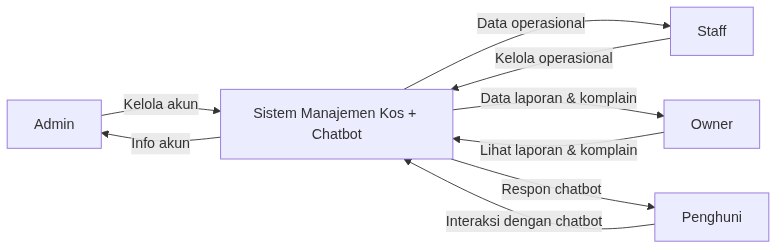

Context diagram menggambarkan sistem sebagai satu kesatuan yang berinteraksi dengan entitas eksternal tanpa menampilkan detail proses internal. Dalam diagram ini, sistem manajemen kos dengan chatbot diposisikan sebagai pusat yang menerima input dan menghasilkan output kepada empat entitas utama, yaitu admin, staff, owner, dan penghuni.

Admin berinteraksi dengan sistem dalam konteks pengelolaan akun, di mana data yang diberikan berupa instruksi pengelolaan pengguna dan sistem mengembalikan informasi akun sebagai hasilnya. Staff berinteraksi dengan sistem dalam lingkup operasional, seperti pengelolaan kamar dan penghuni, serta menerima data operasional sebagai keluaran. Owner menggunakan sistem untuk memperoleh informasi strategis berupa laporan transaksi dan data komplain, tanpa melakukan manipulasi data secara langsung. Sementara itu, penghuni berinteraksi melalui chatbot dengan mengirimkan perintah tertentu dan menerima respons otomatis dari sistem.

### 1.2 Use Case Diagram

Use case diagram merupakan salah satu jenis diagram dalam UML (Unified Modeling Language) yang digunakan untuk menggambarkan interaksi antara aktor dengan sistem. Diagram ini berfokus pada apa saja fungsi atau layanan yang disediakan oleh sistem dari sudut pandang pengguna, tanpa menjelaskan bagaimana proses tersebut dijalankan secara teknis. Dalam konteks sistem manajemen kos, diagram ini berperan penting untuk memperjelas pembagian peran antara admin, staff, owner, dan penghuni, serta bagaimana mereka berinteraksi dengan sistem, terutama melalui chatbot.

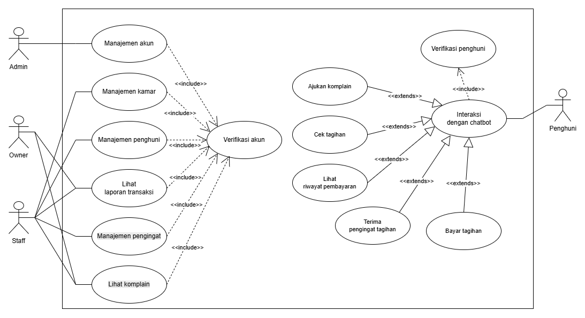

Use case diagram pada sistem ini menggambarkan interaksi antara aktor eksternal dengan sistem manajemen kos yang terintegrasi dengan layanan chatbot. Diagram ini menunjukkan bagaimana setiap aktor memanfaatkan fitur sistem sesuai dengan peran dan kebutuhan masing-masing. Secara umum, sistem menyediakan dua jalur interaksi utama, yaitu melalui antarmuka internal (untuk admin, staff, dan owner) serta melalui chatbot (untuk penghuni). Aktor yang terlibat dalam sistem terdiri dari empat peran utama, yaitu:

- **Admin**: Bertanggung jawab terhadap pengelolaan akun pengguna dalam sistem.
- **Staff**: Menangani operasional harian seperti pengelolaan kamar, penghuni, pengingat, dan komplain.
- **Owner**: Berfokus pada pemantauan melalui laporan transaksi dan komplain tanpa terlibat langsung dalam operasional.
- **Penghuni**: berinteraksi dengan sistem melalui chatbot untuk mengakses layanan seperti cek tagihan, pembayaran, riwayat transaksi, dan pengajuan komplain.

Setiap aktivitas utama dalam sistem, khususnya yang dilakukan oleh admin, staff, dan owner, memiliki keterkaitan (include) dengan proses verifikasi akun, yang berarti sebelum mengakses fitur tersebut pengguna diharuskan melalui proses autentikasi terlebih dahulu. Di sisi lain, aktivitas penghuni seperti mengajukan komplain, mengecek tagihan, melihat riwayat pembayaran, menerima pengingat, dan melakukan pembayaran merupakan perluasan (extends) dari use case utama interaksi dengan chatbot. Dengan demikian, chatbot berperan sebagai pusat layanan bagi penghuni, sementara sistem menangani logika dan pengolahan data.

### 1.3 Activity Diagrams

Activity diagram merupakan diagram UML yang digunakan untuk menggambarkan alur aktivitas atau proses bisnis dalam suatu sistem. Diagram ini menunjukkan urutan langkah-langkah yang dilakukan dari awal hingga akhir, termasuk percabangan keputusan, proses paralel, serta interaksi antar aktor atau komponen sistem. Dalam sistem manajemen kos, activity diagram digunakan untuk menggambarkan proses seperti verifikasi akun, pengelolaan data, pembayaran, hingga pengiriman notifikasi, sehingga alur operasional sistem dapat dipahami secara menyeluruh.

<b>Activity Diagram Verifikasi Akun</b>
 

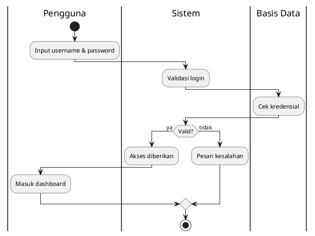

Proses dimulai ketika pengguna memasukkan username dan password ke dalam sistem. Setelah itu, sistem melakukan validasi awal terhadap input yang diberikan. Selanjutnya, data kredensial tersebut diperiksa ke basis data untuk memastikan kecocokan. Jika hasil validasi menunjukkan bahwa data benar, maka sistem memberikan akses kepada pengguna dan pengguna diarahkan masuk ke dashboard. Sebaliknya, apabila data tidak valid, sistem akan menampilkan pesan kesalahan kepada pengguna dan proses berakhir.

<b>Activity Diagram Manajemen Akun</b>
 

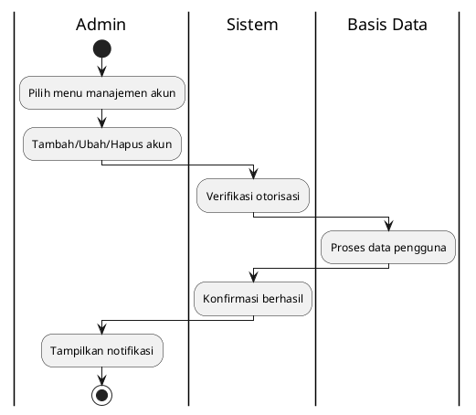

Proses diawali oleh admin dengan memilih menu manajemen akun. Admin kemudian dapat melakukan operasi seperti menambah, mengubah, atau menghapus akun. Setelah itu, sistem melakukan verifikasi terhadap hak akses admin. Jika otorisasi valid, sistem akan meneruskan proses ke basis data untuk memproses perubahan data pengguna. Setelah berhasil, sistem memberikan konfirmasi keberhasilan, dan admin menerima notifikasi sebagai hasil akhir dari proses.

<b>Activity Diagram Manajemen Kamar</b>
 

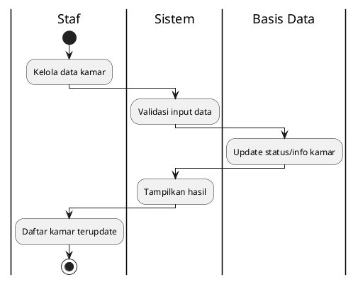

Proses dimulai ketika staf melakukan pengelolaan data kamar. Data yang dimasukkan kemudian divalidasi oleh sistem untuk memastikan kelengkapan dan kebenaran. Setelah valid, sistem mengirimkan data ke basis data untuk memperbarui informasi atau status kamar. Sistem kemudian menampilkan hasil pembaruan, dan staf dapat melihat daftar kamar yang telah diperbarui.

<b>Activity Diagram Manajemen Penghuni</b>
 

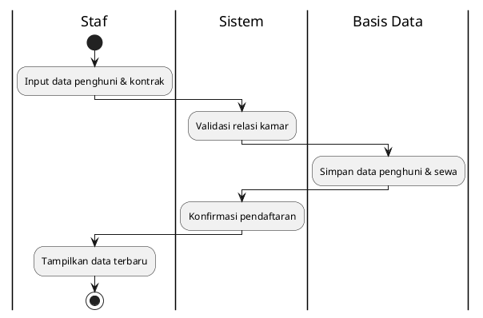

Proses dimulai dengan staf memasukkan data penghuni beserta informasi kontrak sewa. Sistem kemudian memvalidasi keterkaitan antara penghuni dan kamar yang dipilih. Jika valid, data disimpan ke dalam basis data, mencakup informasi penghuni dan detail sewa. Sistem selanjutnya memberikan konfirmasi bahwa pendaftaran berhasil, dan staf dapat melihat data penghuni baru yang telah ditambahkan ke dalam daftar.

<b>Activity Diagram Lihat Laporan Transaksi</b>
 

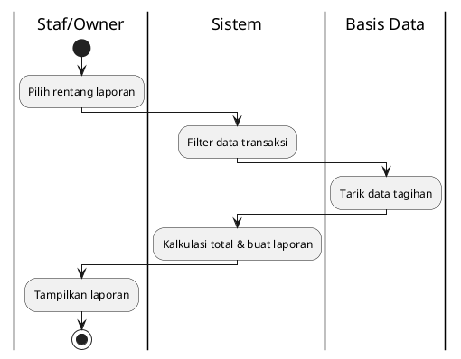

Proses dimulai ketika staf atau pemilik memilih rentang waktu laporan yang diinginkan. Sistem kemudian memfilter data transaksi berdasarkan rentang tersebut. Selanjutnya, sistem mengambil data tagihan dari basis data. Data tersebut kemudian diolah untuk menghitung total dan menghasilkan laporan. Hasil laporan kemudian ditampilkan kepada staf atau pemilik.

<b>Activity Diagram Manajemen Pengingat</b>
 

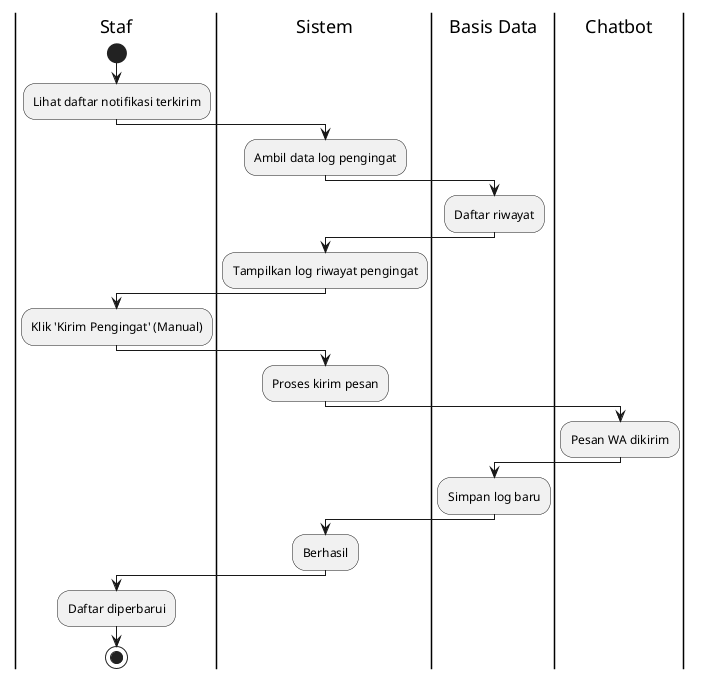

Staf dapat melihat daftar pengingat yang pernah terkirim melalui sistem. Sistem akan mengambil informasi riwayat dari penyimpanan data dan memberikan tampilan daftar notifikasi kepada staf. Jika diinginkan, staf bisa menekan tombol pengiriman pengingat secara manual. Setelah itu, sistem akan segera mengirimkan pesan lewat chatbot dan mencatat riwayat pengiriman baru tersebut agar daftar riwayat selalu terbarui.

<b>Activity Diagram Lihat Komplain</b>
 

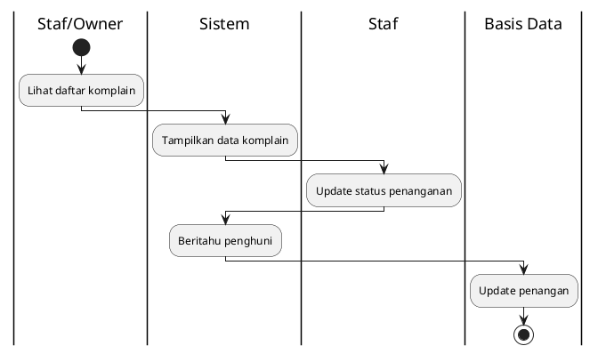

Proses dimulai ketika staf atau pemilik melihat daftar komplain yang tersedia. Sistem menampilkan laporan kerusakan yang telah diajukan oleh penghuni. Staf kemudian melakukan pembaruan status penanganan terhadap komplain tersebut. Sistem selanjutnya mengirimkan pemberitahuan kepada penghuni terkait perkembangan penanganan. Terakhir, basis data diperbarui, khususnya pada field yang menunjukkan pihak yang menyelesaikan komplain.

<b>Activity Diagram Interaksi Chatbot</b>
 

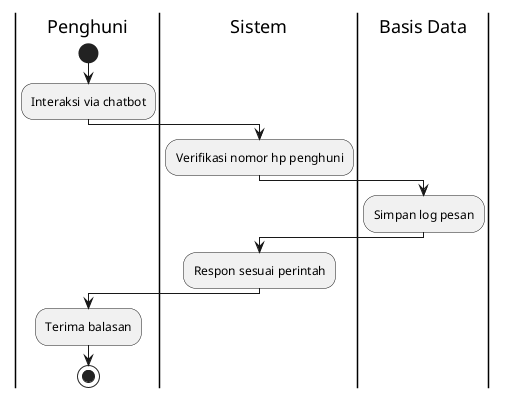

Proses dimulai saat penghuni berinteraksi dengan chatbot. Sistem terlebih dahulu memverifikasi nomor pengguna untuk memastikan keabsahan identitas. Setelah itu, pesan yang dikirim disimpan ke dalam basis data sebagai log. Sistem kemudian memberikan respons sesuai dengan perintah atau pesan yang diterima. Penghuni akhirnya menerima balasan dari sistem.

<b>Activity Diagram Pembayaran</b>
 

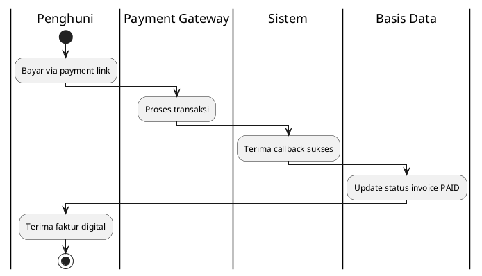

Proses dimulai ketika penghuni melakukan pembayaran melalui tautan pembayaran yang tersedia. Payment gateway kemudian memproses transaksi tersebut. Setelah transaksi berhasil, sistem menerima notifikasi callback sebagai tanda keberhasilan. Selanjutnya, sistem memperbarui status invoice di basis data menjadi “PAID”. Penghuni kemudian menerima bukti pembayaran atau kuitansi sebagai konfirmasi pelunasan.

<b>Activity Diagram Terima Pengingat Tagihan</b>
 

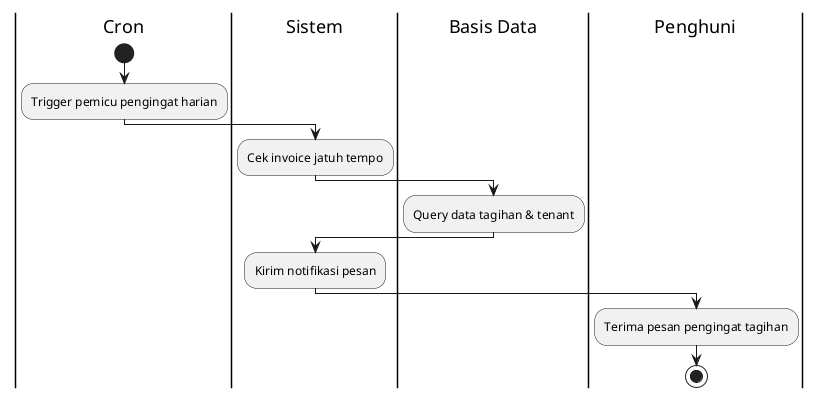

Proses dimulai oleh cron yang secara otomatis memicu pengingat harian. Sistem kemudian memeriksa invoice yang telah jatuh tempo. Data tagihan dan informasi penghuni diambil dari basis data. Sistem kemudian mengirimkan notifikasi berupa pesan pengingat kepada penghuni. Penghuni akhirnya menerima pesan tersebut sebagai pengingat pembayaran.

<b>Activity Diagram Lihat Riwayat Pembayaran</b>
 

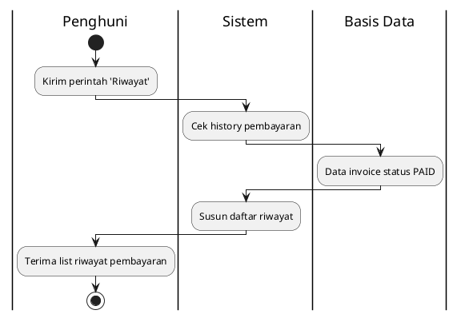

Proses dimulai ketika penghuni mengirimkan perintah untuk melihat riwayat pembayaran. Sistem kemudian memeriksa data riwayat pembayaran yang tersedia. Basis data mengembalikan data invoice dengan status “PAID”. Sistem menyusun daftar riwayat pembayaran secara terstruktur, dan hasilnya dikirimkan kepada penghuni untuk ditampilkan.

<b>Activity Diagram Cek Tagihan</b>
 

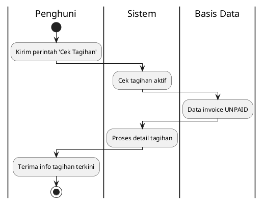

Proses dimulai saat penghuni mengirimkan perintah untuk mengecek tagihan. Sistem kemudian memeriksa tagihan yang masih aktif. Data invoice dengan status “UNPAID” diambil dari basis data. Sistem kemudian merangkum informasi tagihan tersebut, dan hasilnya dikirimkan kepada penghuni sebagai informasi tagihan terkini.

<b>Activity Diagram Ajukan Komplain</b>
 

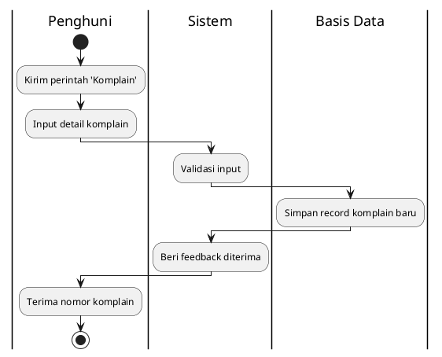

Proses dimulai ketika penghuni mengirimkan perintah untuk mengajukan komplain, kemudian dilanjutkan dengan memasukkan detail kerusakan. Sistem melakukan validasi terhadap data yang diberikan. Jika valid, data komplain disimpan sebagai record baru di basis data. Sistem kemudian memberikan umpan balik bahwa komplain telah diterima, dan penghuni menerima nomor laporan atau ID komplain sebagai referensi.

### 1.4 Sequence Diagrams

Sequence diagram merupakan diagram UML yang digunakan untuk menggambarkan interaksi antar objek dalam sistem berdasarkan urutan waktu. Diagram ini menampilkan bagaimana pesan atau komunikasi dikirimkan dari satu objek ke objek lain secara berurutan untuk menjalankan suatu fungsi tertentu. Pada sistem manajemen kos, sequence diagram digunakan untuk menggambarkan interaksi antara pengguna, sistem, basis data, dan layanan eksternal seperti payment gateway atau chatbot, sehingga alur komunikasi data dapat divisualisasikan dengan lebih rinci dan sistematis.

<b>Sequence Diagram Verifikasi Akun</b>
 

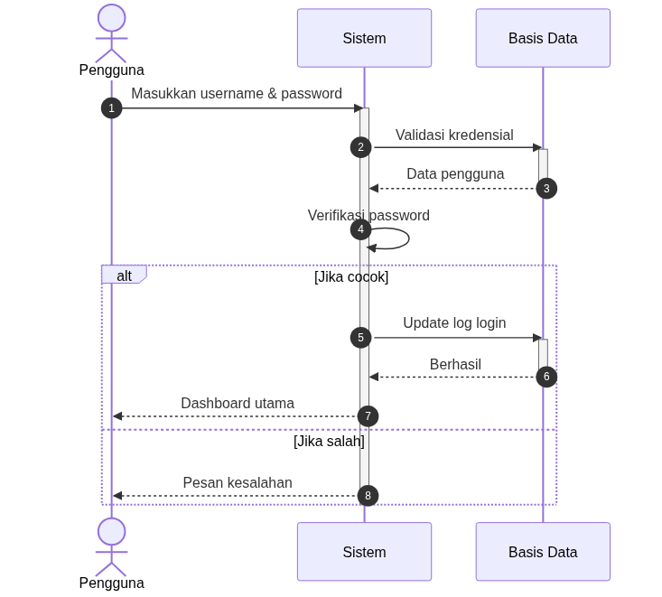

Proses dimulai ketika pengguna memasukkan username dan password ke dalam sistem. Sistem kemudian mengirimkan permintaan ke basis data untuk melakukan validasi kredensial. Basis data mengembalikan data pengguna yang sesuai. Setelah itu, sistem melakukan verifikasi password secara internal. Jika password cocok, sistem memperbarui log login ke basis data dan mengarahkan pengguna ke dashboard utama. Namun, jika password tidak sesuai, sistem langsung mengirimkan pesan kesalahan kepada pengguna.

<b>Sequence Diagram Manajemen Akun</b>
 

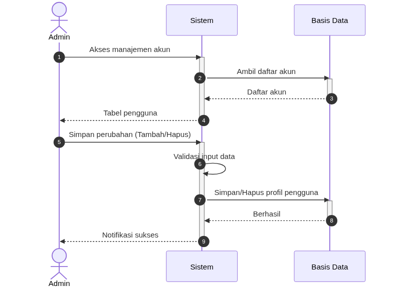

Proses dimulai saat admin mengakses fitur manajemen akun. Sistem kemudian meminta daftar akun ke basis data, dan basis data mengembalikan data tersebut untuk ditampilkan kepada admin. Setelah itu, admin melakukan perubahan seperti menambah atau menghapus akun. Sistem melakukan validasi terhadap input yang diberikan, kemudian mengirimkan perintah ke basis data untuk menyimpan atau menghapus data pengguna. Setelah proses berhasil, sistem memberikan notifikasi sukses kepada admin.

<b>Sequence Diagram Manajemen Kamar</b>
 

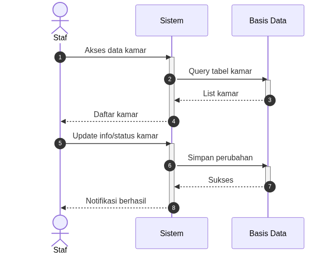

Proses diawali oleh staf yang mengakses data kamar melalui sistem. Sistem kemudian melakukan query ke basis data untuk mengambil daftar kamar, dan hasilnya dikirim kembali ke sistem untuk ditampilkan kepada staf. Selanjutnya, staf melakukan pembaruan terhadap informasi atau status kamar. Sistem menyimpan perubahan tersebut ke basis data, dan setelah berhasil, sistem memberikan notifikasi kepada staf bahwa proses telah selesai.

<b>Sequence Diagram Manajemen Penghuni</b>
 

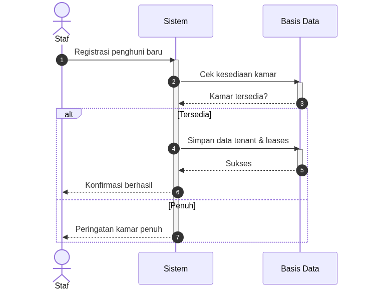

Proses dimulai ketika staf melakukan registrasi penghuni baru. Sistem terlebih dahulu memeriksa ketersediaan kamar dengan mengirimkan permintaan ke basis data. Basis data mengembalikan informasi apakah kamar tersedia atau tidak. Jika kamar tersedia, sistem menyimpan data penghuni dan kontrak sewa ke basis data, lalu memberikan konfirmasi keberhasilan kepada staf. Jika kamar penuh, sistem memberikan peringatan kepada staf bahwa kamar tidak tersedia.

<b>Sequence Diagram Lihat Laporan Transaksi</b>
 

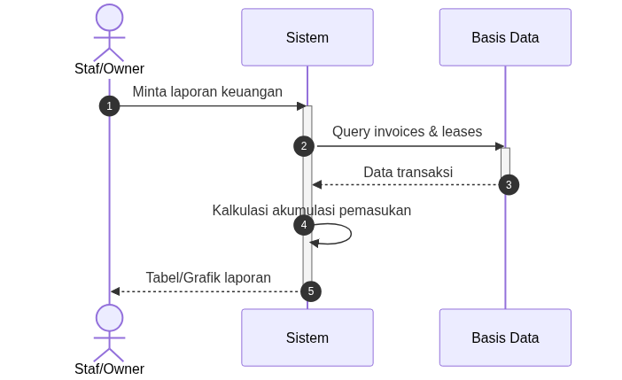

Proses dimulai saat pengelola (staf atau pemilik) meminta laporan keuangan. Sistem kemudian mengambil data transaksi dari basis data yang mencakup invoice dan data sewa. Setelah data diterima, sistem melakukan perhitungan total pemasukan secara internal. Hasil perhitungan tersebut kemudian disajikan dalam bentuk tabel atau grafik kepada pengelola.

<b>Sequence Diagram Manajemen Pengingat</b>
 

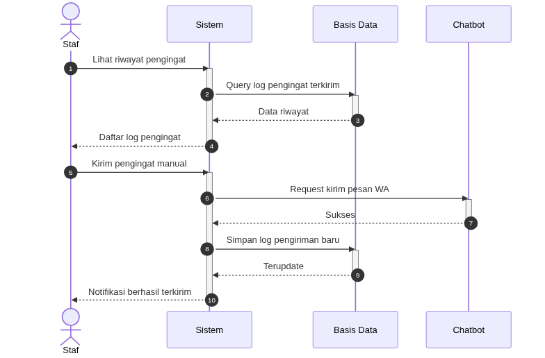

Proses diawali saat staf meminta data riwayat pengingat kepada sistem. Sistem kemudian melakukan pencarian data di dalam sistem penyimpanan dan menampilkannya kembali kepada staf. Staf selanjutnya memberikan instruksi untuk melakukan pengiriman pengingat secara manual. Sistem akan meneruskan permintaan tersebut melalui chatbot dan mencatat bukti pengiriman baru di dalam sistem penyimpanan, lalu memberikan konfirmasi akhir kepada staf.

<b>Sequence Diagram Lihat Komplain</b>
 

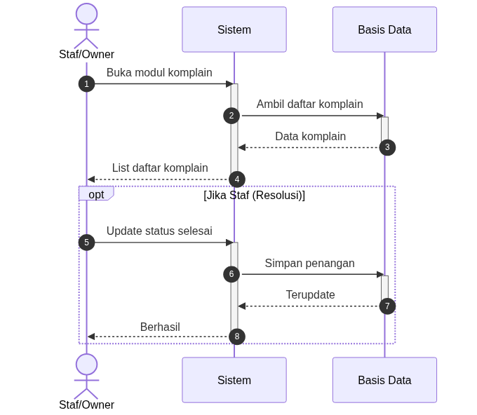

Proses dimulai ketika pengelola membuka modul komplain. Sistem mengambil daftar komplain dari basis data dan menampilkannya kepada pengelola. Jika pengelola bertindak sebagai staf yang menangani komplain, maka staf dapat memperbarui status komplain menjadi selesai. Sistem kemudian menyimpan informasi penanganan dan penanggung jawab ke basis data. Setelah berhasil, sistem memberikan konfirmasi kepada pengelola.

<b>Sequence Diagram Interaksi Chatbot</b>
 

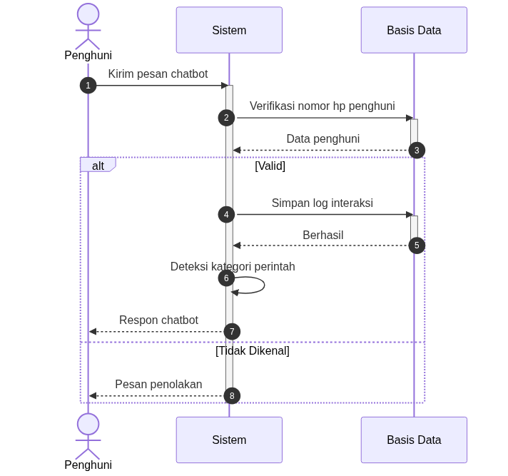

Proses dimulai saat penghuni mengirimkan pesan melalui chatbot. Sistem melakukan verifikasi nomor telepon ke basis data untuk memastikan identitas pengguna. Jika nomor valid, sistem menyimpan log interaksi dan mengidentifikasi kategori perintah yang diberikan. Setelah itu, sistem mengirimkan respons yang sesuai kepada penghuni. Jika nomor tidak dikenali, sistem langsung mengirimkan pesan penolakan.

<b>Sequence Diagram Pembayaran</b>
 

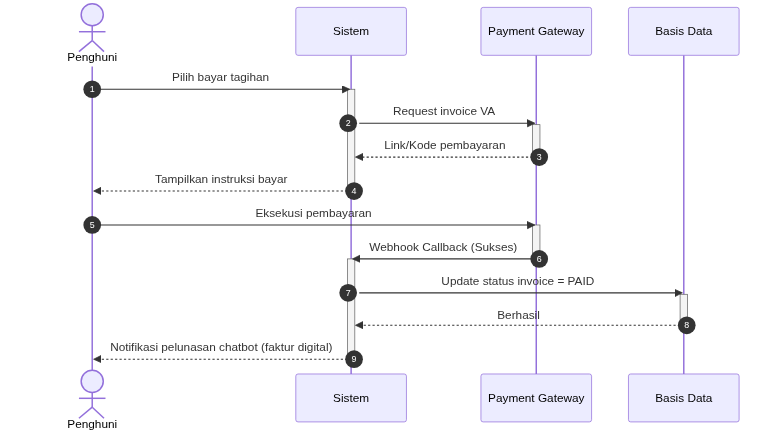

Proses dimulai ketika penghuni memilih untuk membayar tagihan. Sistem mengirimkan permintaan ke payment gateway untuk membuat invoice virtual account. Gateway kemudian mengembalikan kode atau tautan pembayaran yang ditampilkan kepada penghuni. Setelah penghuni melakukan pembayaran, gateway mengirimkan notifikasi (callback) ke sistem. Sistem kemudian memperbarui status invoice menjadi “PAID” di basis data dan mengirimkan notifikasi pelunasan kepada penghuni.

<b>Sequence Diagram Terima Pengingat Tagihan</b>
 

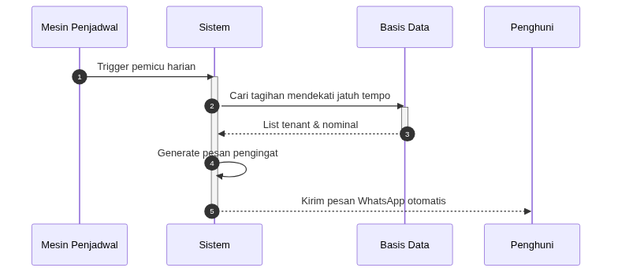

Proses dimulai oleh mesin penjadwal yang memicu sistem secara harian. Sistem kemudian meminta data tagihan yang mendekati jatuh tempo ke basis data. Setelah data diterima, sistem menyusun pesan pengingat secara otomatis. Pesan tersebut kemudian dikirimkan kepada penghuni melalui media komunikasi WhatsApp.

<b>Sequence Diagram Lihat Riwayat Pembayaran</b>
 

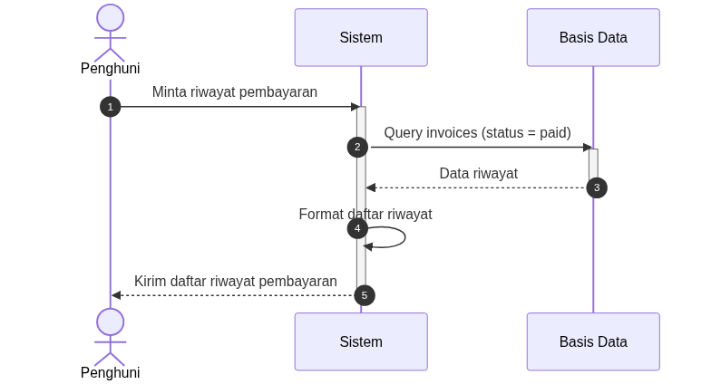

Proses dimulai ketika penghuni meminta riwayat pembayaran. Sistem mengirimkan permintaan ke basis data untuk mengambil data invoice dengan status sudah dibayar. Setelah data diterima, sistem memformat daftar riwayat pembayaran agar mudah dibaca. Hasilnya kemudian dikirimkan kembali kepada penghuni.

<b>Sequence Diagram Cek Tagihan</b>
 

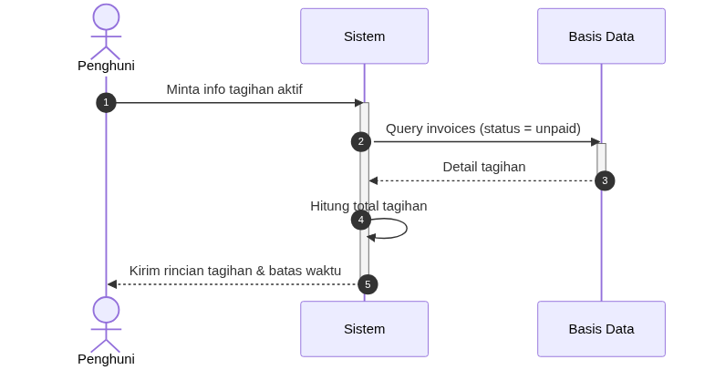

Proses dimulai saat penghuni meminta informasi tagihan aktif. Sistem mengambil data invoice dengan status belum dibayar dari basis data. Setelah data diterima, sistem menghitung total tagihan secara keseluruhan. Informasi tersebut kemudian dikirimkan kepada penghuni dalam bentuk rincian tagihan beserta batas waktu pembayaran.

<b>Sequence Diagram Ajukan Komplain</b>
 

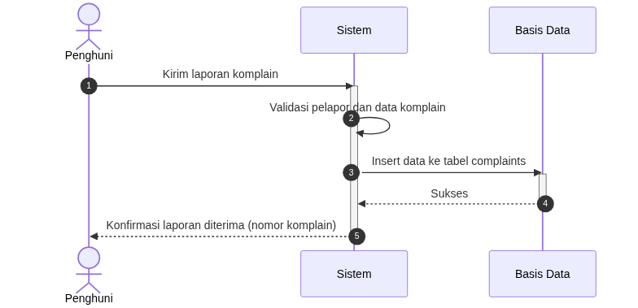

Proses dimulai ketika penghuni mengirimkan laporan komplain ke sistem. Sistem terlebih dahulu melakukan validasi terhadap kelengkapan isi laporan. Setelah valid, sistem menyimpan data komplain ke dalam basis data. Basis data mengembalikan status sukses beserta ID komplain. Sistem kemudian mengirimkan konfirmasi kepada penghuni bahwa laporan telah diterima.

### 1.5 Class Diagram

Class diagram merupakan diagram UML yang digunakan untuk menggambarkan struktur statis dari sistem, termasuk kelas-kelas yang ada, atribut yang dimiliki, serta hubungan antar kelas. Diagram ini berfokus pada bagaimana data dan objek dalam sistem diorganisasikan. Dalam sistem manajemen kos, class diagram berfungsi untuk memodelkan entitas seperti pengguna, penghuni, kamar, sewa, tagihan, notifikasi, dan komplain, sehingga seluruh proses bisnis dapat direpresentasikan secara terstruktur dan saling terhubung.

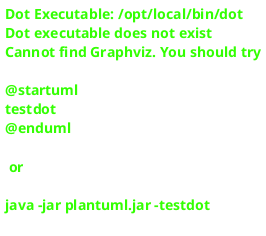

Class diagram pada sistem ini menggambarkan struktur data serta hubungan antar entitas yang membentuk keseluruhan sistem manajemen kos. Setiap kelas merepresentasikan objek nyata dalam sistem, seperti pengguna, penghuni, kamar, transaksi, hingga komunikasi melalui chatbot. Diagram ini juga menunjukkan bagaimana data saling terhubung untuk mendukung proses bisnis yang ada.

Relasi antar kelas menunjukkan keterkaitan yang erat dalam sistem, seperti tenant yang dapat memiliki banyak lease dan komplain, lease yang menghasilkan invoice, serta invoice yang memicu notifikasi. Struktur ini dirancang untuk memastikan integritas data dan mendukung alur proses bisnis secara menyeluruh, mulai dari penyewaan kamar hingga penyelesaian komplain dan pembayaran.

---

## 2. Rancangan Basis Data

Rancangan basis data merupakan tahap perancangan yang bertujuan untuk mendefinisikan struktur penyimpanan data yang akan digunakan oleh sistem. Pada sistem manajemen kos ini, rancangan basis data disusun untuk mendukung seluruh proses bisnis yang telah dianalisis sebelumnya, mulai dari pengelolaan pengguna, operasional kos, transaksi pembayaran, hingga interaksi melalui chatbot.

Rancangan basis data pada sistem manajemen kos ini disusun berdasarkan hasil analisis dan perancangan yang telah dilakukan pada diagram sebelumnya, yaitu use case diagram, context diagram, activity diagram, sequence diagram, dan class diagram. Setiap tabel yang dibentuk merupakan representasi langsung dari entitas dan relasi yang telah diidentifikasi pada class diagram, serta mendukung alur proses bisnis yang tergambar dalam activity dan sequence diagram.

### 2.1 Entity Relationship Diagram

Entity relationship diagram (ERD) merupakan diagram yang digunakan untuk memodelkan struktur penyimpanan data dalam basis data dengan menunjukkan entitas, atribut, dan hubungan antarentitas tersebut. Berbeda dengan class diagram yang berfokus pada objek dalam kode program, ERD berfokus pada bagaimana data disimpan secara permanen di dalam tabel basis data. Dalam sistem manajemen kos ini, ERD memberikan panduan teknis yang jelas untuk memastikan bahwa seluruh informasi penting tersimpan dalam struktur yang efisien dan saling terintegrasi.

ERD pada sistem ini memberikan gambaran menyeluruh tentang bagaimana data diorganisasikan di dalam basis data untuk mendukung kelancaran operasional. Setiap kotak dalam diagram merepresentasikan sebuah tabel yang menyimpan informasi spesifik, seperti profil penghuni, rincian kamar, dokumen tagihan, atau log interaksi chatbot. Hubungan antar kotak tersebut menunjukkan bagaimana sistem menghubungkan satu informasi dengan informasi lainnya guna mendukung proses bisnis utama.

Relasi di dalam ERD ini dirancang untuk menjaga keteraturan dan integritas data, seperti menghubungkan penghuni dengan kamar yang mereka tempati melalui kontrak sewa (lease), serta menghubungkan setiap pembayaran dengan dokumen tagihan yang sesuai. Dengan struktur yang terintegrasi ini, sistem dapat dengan mudah melacak riwayat penyewaan, mengelola data pembayaran secara akurat, serta memproses komplain dan notifikasi pengingat secara otomatis kepada penghuni yang bersangkutan.

### 2.2 Rincian Tabel Basis Data

### `users`

Tabel users menyimpan data login pengguna sistem (admin, staff, owner, dan sistem otomatis). Tabel ini digunakan untuk memverifikasi identitas pengguna sebelum mengakses fitur sistem.

| Nama Kolom        | Tipe Data        | Keterangan                              |
| ----------------- | ---------------- | --------------------------------------- |
| `id`              | INTEGER (PK, AI) | ID pengguna unik.                       |
| `username`        | TEXT (Unique)    | Nama untuk masuk ke sistem.             |
| `password_hash`   | TEXT             | Kata sandi yang sudah dienkripsi.       |
| `display_name`    | TEXT             | Nama tampilan di antarmuka.             |
| `role`            | TEXT             | Peran pengguna (admin/staff/owner/system). |
| `last_accessed`   | TIMESTAMP        | Waktu terakhir kali akun ini digunakan. |

Field `username`, `password_hash`, dan `role` digunakan untuk mengatur hak akses berdasarkan peran pengguna. Kolom `last_accessed` mencatat kapan pengguna terakhir menggunakan sistem.

### `tenants`

Tabel tenants menyimpan data penghuni kos. Data ini digunakan untuk penyewaan kamar, pengiriman notifikasi, dan interaksi melalui chatbot.

| Nama Kolom      | Tipe Data        | Keterangan                          |
| --------------- | ---------------- | ----------------------------------- |
| `id`            | INTEGER (PK, AI) | ID penghuni unik.                   |
| `full_name`     | TEXT             | Nama lengkap penghuni.              |
| `phone_number`  | TEXT (Unique)    | Nomor WhatsApp untuk chatbot.       |
| `origin_region` | TEXT NULL        | Daerah asal penghuni.               |
| `is_verified`   | BOOLEAN          | Status verifikasi penghuni.         |

Kolom `phone_number` digunakan sebagai identitas saat berkomunikasi melalui chatbot WhatsApp. Field `is_verified` menandakan apakah data penghuni sudah diverifikasi oleh staff. Tabel ini terhubung dengan tabel leases, chatbot_messages, notifications, dan complaints.

### `rooms`

Tabel rooms menyimpan informasi kamar yang tersedia. Data ini digunakan staff untuk mengelola kamar kos.

| Nama Kolom      | Tipe Data        | Keterangan                                |
| --------------- | ---------------- | ----------------------------------------- |
| `id`            | INTEGER (PK, AI) | ID kamar unik.                            |
| `room_number`   | TEXT (Unique)    | Nomor kamar yang tertera di pintu.        |
| `room_type`     | TEXT             | Jenis kamar (standard/premium).           |
| `monthly_price` | INTEGER          | Harga sewa per bulan dalam Rupiah.        |
| `is_active`     | BOOLEAN          | Status kamar (tersedia/tidak).            |

Field `room_type` wajib diisi (standard atau premium). Kolom `is_active` menunjukkan apakah kamar bisa disewa. Tabel ini berelasi dengan tabel leases yang menghubungkan kamar dengan penghuni.

### `leases`

Tabel leases menghubungkan penghuni (tenants) dengan kamar (rooms). Tabel ini mencatat informasi penyewaan kamar.

| Nama Kolom   | Tipe Data        | Keterangan                                        |
| ------------ | ---------------- | ------------------------------------------------- |
| `id`         | INTEGER (PK, AI) | ID kontrak penyewaan unik.                        |
| `tenant_id`  | INTEGER (FK)     | ID penghuni yang menyewa.                         |
| `room_id`    | INTEGER (FK)     | ID kamar yang ditempati.                          |
| `start_date` | TIMESTAMP        | Tanggal mulai sewa berlaku.                       |
| `end_date`   | TIMESTAMP        | Tanggal sewa berakhir (kosong jika masih aktif).  |
| `is_active`  | BOOLEAN          | Status penyewaan (masih aktif/telah selesai).     |

Field `start_date`, `end_date`, dan `is_active` digunakan untuk melacak masa sewa. Tabel ini terkait dengan activity diagram manajemen penghuni dan sequence diagram registrasi penghuni, di mana sistem memeriksa ketersediaan kamar sebelum menyimpan data sewa.

### `invoices`

Tabel invoices mencatat tagihan yang dihasilkan dari penyewaan. Setiap invoice terhubung dengan satu data lease (kontrak sewa).

| Nama Kolom         | Tipe Data        | Keterangan                                    |
| ------------------ | ---------------- | --------------------------------------------- |
| `id`               | INTEGER (PK, AI) | ID tagihan unik.                              |
| `lease_id`         | INTEGER (FK)     | ID kontrak sewa yang ditagihkan.              |
| `amount`           | INTEGER          | Nominal yang harus dibayar (Rupiah).          |
| `due_date`         | TIMESTAMP        | Tanggal batas pembayaran.                     |
| `paid_at`          | TIMESTAMP        | Waktu pembayaran diterima.                    |
| `duitku_reference` | TEXT             | Kode referensi dari payment gateway.          |
| `callback_payload` | TEXT             | Data mentah dari notifikasi payment gateway.  |
| `status`           | TEXT             | Status tagihan (unpaid/paid/overdue).         |
| `created_at`       | TIMESTAMP        | Waktu tagihan dibuat.                         |

Field `due_date`, `status`, dan `duitku_reference` mendukung proses pembayaran. Kolom `paid_at` mencatat waktu pembayaran diterima, dan `created_at` mencatat kapan tagihan dibuat. Tabel ini terintegrasi dengan layanan payment gateway Duitku.

### `chatbot_messages`

Tabel chatbot_messages menyimpan riwayat percakapan antara penghuni dan chatbot WhatsApp. Setiap pesan yang masuk dan keluar akan tercatat sebagai log.

| Nama Kolom  | Tipe Data        | Keterangan                            |
| ----------- | ---------------- | ------------------------------------- |
| `id`        | INTEGER (PK, AI) | ID pesan unik.                        |
| `tenant_id` | INTEGER (FK)     | ID penghuni yang berkomunikasi.       |
| `direction` | TEXT             | Arah pesan (incoming/outgoing).       |
| `message`   | TEXT             | Isi pesan teks.                       |
| `sent_at`   | TIMESTAMP        | Waktu pesan dikirim.                  |

Tabel ini mencatat setiap interaksi chatbot untuk keperluan monitoring dan evaluasi layanan komunikasi dengan penghuni.

### `notifications`

Tabel notifications mencatat notifikasi yang dikirim kepada penghuni, seperti pengingat tagihan atau konfirmasi pembayaran.

| Nama Kolom           | Tipe Data            | Keterangan                                      |
| -------------------- | -------------------- | ----------------------------------------------- |
| `id`                 | INTEGER (PK, AI)     | ID notifikasi unik.                             |
| `tenant_id`          | INTEGER (FK)         | ID penghuni penerima notifikasi.                |
| `invoice_id`         | INTEGER (FK)         | ID tagihan terkait (jika ada).                  |
| `chatbot_message_id` | INTEGER (Unique, FK) | ID pesan chatbot yang dikirim.                  |
| `type`               | TEXT                 | Jenis notifikasi (reminder/payment_success/welcome/custom). |
| `status`             | TEXT                 | Status pengiriman (pending/sent/failed).        |
| `created_at`         | TIMESTAMP            | Waktu notifikasi dibuat.                        |

Tabel ini menghubungkan notifikasi dengan tagihan dan pesan chatbot, memungkinkan sistem mengelola komunikasi otomatis dengan penghuni.

### `audit_logs`

Tabel audit_logs mencatat setiap aktivitas pengguna dalam sistem untuk keperluan keamanan dan monitoring.

| Nama Kolom   | Tipe Data        | Keterangan                                    |
| ------------ | ---------------- | --------------------------------------------- |
| `id`         | INTEGER (PK, AI) | ID log aktivitas unik.                        |
| `user_id`    | INTEGER (FK)     | ID pengguna yang melakukan aktivitas.         |
| `action`     | TEXT             | Jenis aksi (CREATE/UPDATE/DELETE/REJECT/LOGIN). |
| `table_name` | TEXT             | Nama tabel yang terpengaruh.                  |
| `record_id`  | INTEGER          | ID data yang diubah (bisa kosong).            |
| `details`    | JSON             | Informasi tambahan dalam format JSON.         |
| `created_at` | TIMESTAMP        | Waktu aktivitas terjadi.                      |

Setiap perubahan data akan tercatat di tabel ini, termasuk siapa yang melakukan, kapan, dan data apa yang terpengaruh. Field `details` menyimpan informasi tambahan dalam format JSON untuk kebutuhan audit yang lebih detail.

### `complaints`

Tabel complaints menyimpan data laporan masalah atau kerusakan yang diajukan penghuni melalui chatbot.

| Nama Kolom       | Tipe Data         | Keterangan                                       |
| ---------------- | ----------------- | ------------------------------------------------ |
| `id`             | INTEGER (PK, AI)  | ID komplain unik.                                |
| `tenant_id`      | INTEGER (FK)      | ID penghuni yang mengajukan.                     |
| `description`    | TEXT              | Deskripsi masalah atau kerusakan.                |
| `status`         | TEXT              | Status penanganan (open/in_progress/resolved).   |
| `processed_at`   | TIMESTAMP         | Waktu mulai diproses oleh staff.                 |
| `resolved_by`    | INTEGER (FK)      | ID staff yang menyelesaikan komplain.            |
| `resolve_notes`  | TEXT              | Catatan penyelesaian dari staff.                 |
| `resolved_at`    | TIMESTAMP         | Waktu komplain diselesaikan.                     |
| `created_at`     | TIMESTAMP         | Waktu komplain dibuat.                           |

Field `status` melacak progres penanganan komplain. Field `resolved_by`, `resolve_notes`, dan `resolved_at` mencatat informasi penyelesaian oleh staff.

### `bot_auth`

Tabel bot_auth menyimpan kredensial autentikasi untuk chatbot WhatsApp dalam format key-value.

| Nama Kolom | Tipe Data     | Keterangan                        |
| ---------- | ------------- | --------------------------------- |
| `key`      | TEXT (PK)     | Nama kunci autentikasi.           |
| `value`    | TEXT          | Nilai autentikasi terenkripsi.    |

Tabel ini digunakan untuk menyimpan session token atau kredensial chatbot agar tetap terkoneksi dengan layanan WhatsApp.
