# 📄 Dokumentasi Antarmuka Sistem Manajemen Kos (Tangkapan Layar)

Dokumen ini menjelaskan tangkapan layar (*screenshot*) antarmuka aplikasi **Indekos Ungu** yang diambil langsung dari implementasi sistem. Penjelasan memuat fungsi utama tiap halaman serta tombol aksi yang tersedia bagi pengelola kos. Struktur dokumen mengikuti pembagian `input` (halaman pengelolaan data) dan `output` (laporan/dokumen cetak) seperti pada folder `wireframe-v2`.

---

## 🧾 A. Antarmuka Manajemen dan Pengelolaan Data (Input)

Halaman-halaman ini digunakan oleh pengelola atau pemilik kos untuk melihat, mencari, menyaring, dan mengelola data operasional kos sehari-hari.

---

1. Dashboard

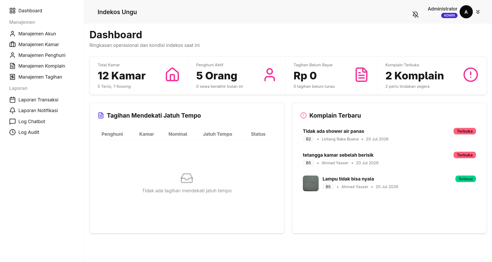

Halaman utama yang menampilkan ringkasan kondisi kos secara keseluruhan, seperti jumlah total kamar, kamar yang kosong atau terisi, penghuni aktif, total tagihan, serta jumlah komplain yang belum terselesaikan. Terdapat pula peringatan tagihan yang mendekati jatuh tempo dan daftar komplain terbaru dari penghuni.

Bagian Tagihan Mendekati Jatuh Tempo menampilkan daftar tagihan yang perlu segera ditindaklanjuti beserta penghuni, kamar, nominal, jatuh tempo, dan statusnya. Bagian Komplain Terbaru menampilkan ringkasan keluhan terakhir beserta status penanganannya.

---

2. Manajemen Akun

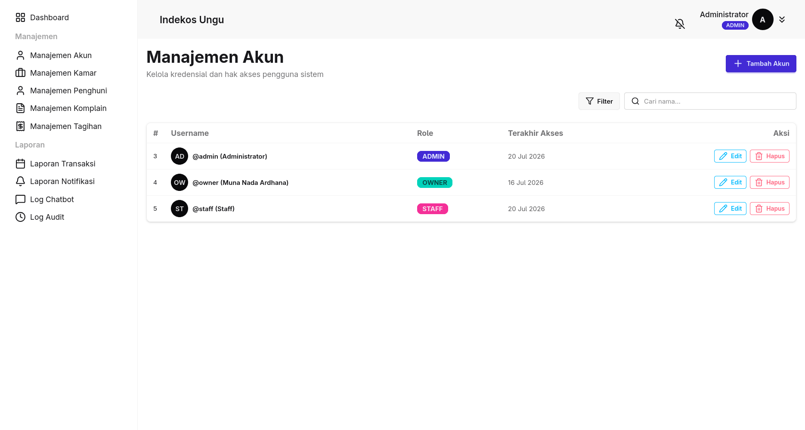

Halaman pengelolaan akun pengguna sistem. Setiap akun memiliki nama pengguna, peran, dan waktu terakhir mengakses sistem.

Tombol Tambah Akun digunakan untuk membuat akun baru. Setiap baris akun memiliki tombol *Edit* untuk mengubah informasi akun dan tombol Hapus untuk menghapus akun dari sistem. Tersedia fitur Pencarian berdasarkan nama pengguna dan *Filter* berdasarkan peran.

---

3. Manajemen Kamar

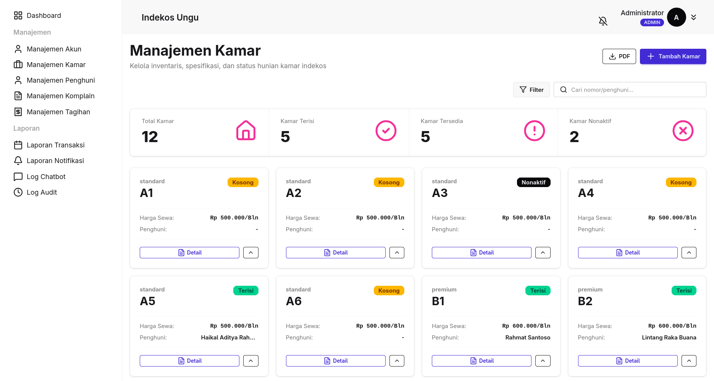

Halaman untuk melihat seluruh data unit kamar kos beserta status ketersediaannya. Informasi mencakup nomor kamar, tipe kamar, harga sewa bulanan, dan status (Kosong, Terisi, atau Nonaktif). Data ditampilkan dalam bentuk kartu visual.

Tombol *PDF* digunakan untuk mengunduh laporan kamar dan tombol Tambah Kamar untuk menambah unit baru. Setiap kartu kamar memiliki tombol Detail untuk melihat informasi lengkap, serta tombol *expand* (^) untuk mengakses aksi *Edit* Kamar dan Hapus. Tersedia fitur Pencarian berdasarkan nomor atau tipe kamar dan *Filter* berdasarkan status.

---

4. Manajemen Penghuni

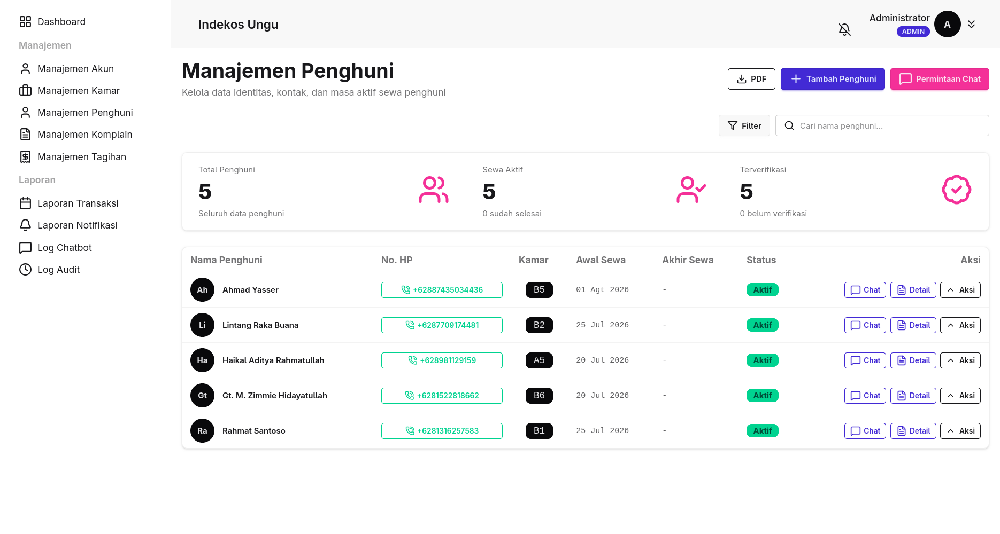

Halaman untuk mengelola data penyewa yang menempati kamar kos. Informasi mencakup nama lengkap, nomor telepon, kamar yang ditempati, periode sewa, dan status keaktifan penghuni.

Tombol *PDF* digunakan untuk mengunduh laporan penghuni, tombol Tambah Penghuni untuk mendaftarkan penyewa baru, dan tombol Permintaan *Chat* untuk membuka daftar permintaan *WhatsApp*. Setiap baris memiliki tombol *Chat* (*WhatsApp*), Detail, dan *dropdown* Aksi yang berisi opsi *Edit* Penghuni, Pindah Kamar, Berhenti Menginap, serta Nonaktifkan Penghuni. Tersedia fitur Pencarian berdasarkan nama penghuni dan *Filter* berdasarkan status.

---

5. Manajemen Komplain

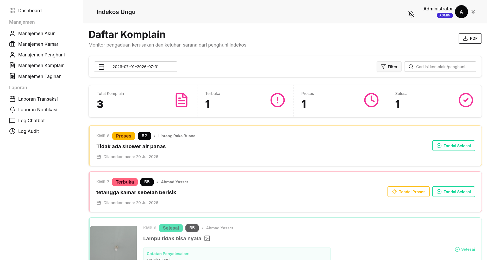

Halaman untuk melacak keluhan atau kerusakan fasilitas dari penghuni kos. Setiap komplain mencakup deskripsi keluhan, status penanganan (Terbuka, Proses, Selesai), kamar terkait, nama penghuni pelapor, serta catatan tindak lanjut.

Tombol *PDF* digunakan untuk mengunduh laporan komplain. Kotak Pilih Periode digunakan untuk memfilter berdasarkan rentang waktu. Tombol Tandai Proses digunakan untuk mengubah status menjadi sedang diproses, dan tombol Tandai Selesai untuk menyelesaikan komplain. Tersedia fitur Pencarian berdasarkan kata kunci deskripsi atau nama penghuni dan *Filter* berdasarkan status penanganan.

---

6. Transaksi Keuangan

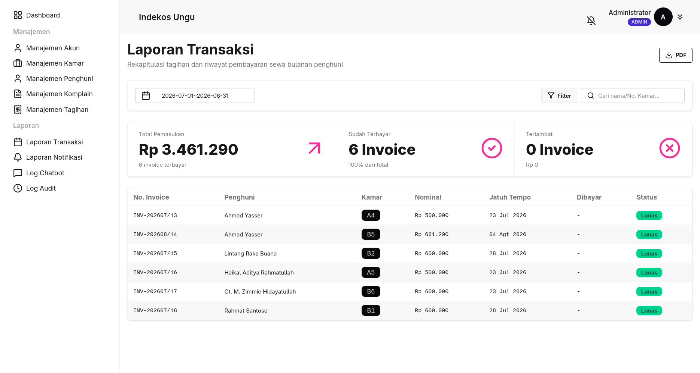

Halaman untuk melihat rekapitulasi tagihan dan riwayat pembayaran sewa bulanan penghuni. Setiap transaksi mencakup nomor *invoice*, nama penghuni, kamar, nominal, tanggal jatuh tempo, tanggal pembayaran, dan status pembayaran.

Tombol *PDF* digunakan untuk mengunduh laporan transaksi. Kotak Pilih Periode digunakan untuk memfilter berdasarkan bulan. Tersedia fitur Pencarian berdasarkan nama penghuni atau nomor kamar dan *Filter* berdasarkan status kelunasan.

---

7. Notifikasi

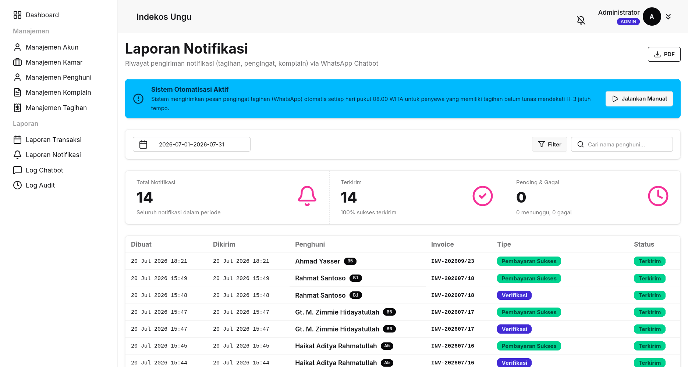

Halaman untuk memantau pesan pengingat tagihan via *WhatsApp* yang dikirim sistem secara otomatis maupun manual. Setiap notifikasi mencatat waktu pengiriman, penghuni tujuan, jenis notifikasi, dan status terkirim atau gagal.

*Banner* Sistem Otomatisasi Aktif menampilkan informasi jadwal pengiriman otomatis setiap pukul 08:00 WITA. Tombol Jalankan Manual digunakan untuk mengirim pengingat secara langsung kepada penghuni yang belum lunas. Tombol *PDF* digunakan untuk mencetak riwayat notifikasi. Kotak Pilih Periode digunakan untuk memfilter berdasarkan bulan pengiriman dan fitur Pencarian untuk menelusuri berdasarkan nama penerima atau status.

---

8. Log Chatbot

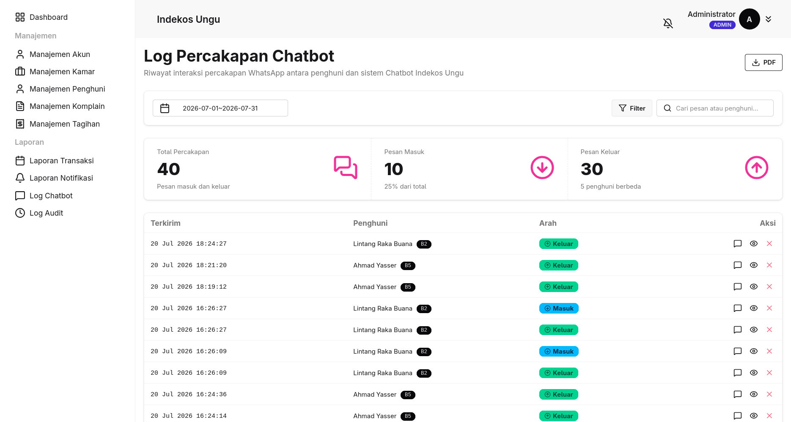

Halaman untuk melihat riwayat percakapan antara *chatbot* *WhatsApp* dengan penghuni. Setiap percakapan mencatat waktu terkirim, nama penghuni, kamar, arah pesan (Masuk/Keluar), serta isi pesan.

Tombol *PDF* digunakan untuk mengunduh laporan *chatbot*. Kotak Pilih Periode digunakan untuk memfilter berdasarkan bulan pelaporan dan fitur Pencarian untuk menemukan percakapan berdasarkan nama penghuni atau kata kunci isi pesan.

---

9. Audit Log

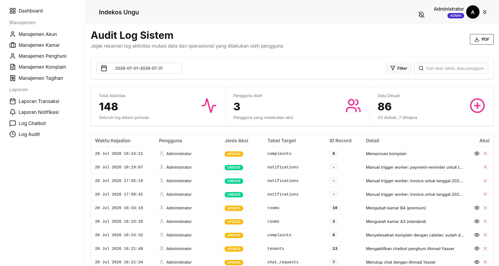

Halaman untuk mencatat seluruh aktivitas pengguna di dalam sistem. Setiap catatan memuat waktu kejadian, nama pengguna yang melakukan aksi, jenis aksi (CREATE/UPDATE/DELETE), tabel target, ID *record*, serta detail perubahan.

Tombol *PDF* digunakan untuk mengunduh laporan audit dan tombol Detail per catatan audit untuk melihat rincian perubahan. Tersedia fitur Pencarian berdasarkan aksi, tabel, atau pengguna dan *Filter* berdasarkan jenis aksi (CREATE, UPDATE, DELETE).

---

10. Halaman Login

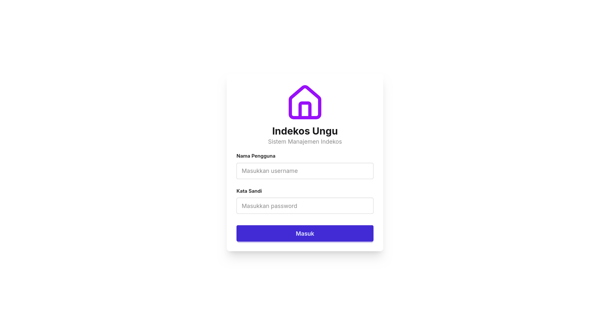

Halaman masuk untuk mengakses sistem. Pengguna wajib memasukkan nama pengguna dan kata sandi yang benar. Jika berhasil, diarahkan ke *dashboard* sesuai peran.

---

11. Manajemen Tagihan

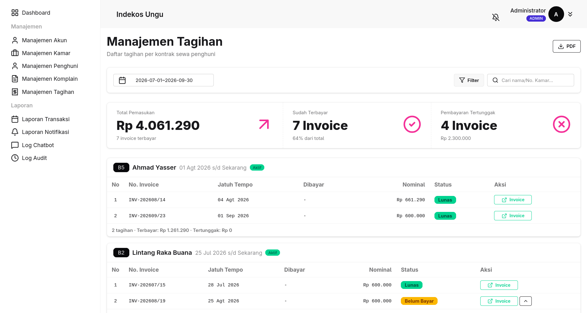

Halaman untuk mengelola daftar tagihan per kontrak sewa penghuni. Data ditampilkan per grup kontrak sewa, mencakup nomor kamar, nama penghuni, periode sewa (tanggal awal *s/d* sekarang), dan status keaktifan. Setiap tagihan mencakup nomor *invoice*, tanggal jatuh tempo, tanggal pembayaran, nominal, dan status (Lunas, Belum Bayar, Terlambat).

Tombol *PDF* digunakan untuk mengunduh laporan tagihan. Kotak Pilih Periode digunakan untuk memfilter berdasarkan bulan. Tersedia fitur Pencarian berdasarkan nama penghuni atau nomor kamar dan *Filter* berdasarkan status. Pada setiap tagihan, tersedia tombol Generate untuk membuat tautan pembayaran beserta Tandai Lunas jika *link* belum di-generate, atau tombol Salin *Link* untuk menyalin URL pembayaran beserta Tandai Lunas jika *link* sudah di-generate, serta tombol *Invoice* untuk membuka halaman *invoice* penghuni.

---

## 📋 B. Antarmuka Laporan dan Dokumen Keluaran (Output)

Laporan ini menampilkan data operasional kos secara terstruktur dalam format cetak, dengan kop surat resmi, ringkasan statistik, tabel data, serta tanda tangan untuk pengarsipan atau evaluasi.

---

1. Laporan Penghuni

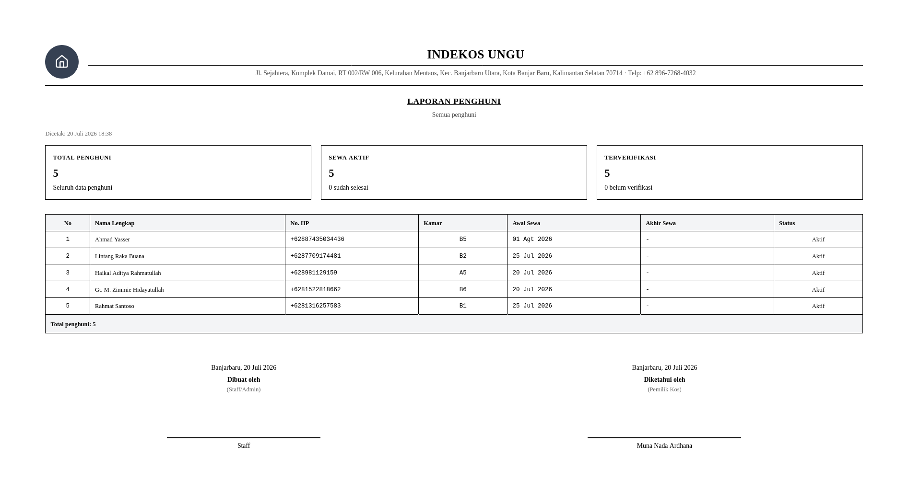

Laporan daftar penghuni kos yang sedang aktif menempati kamar. Data mencakup nama lengkap, nomor telepon, kamar, periode sewa, dan status keaktifan.

---

2. Laporan Kamar

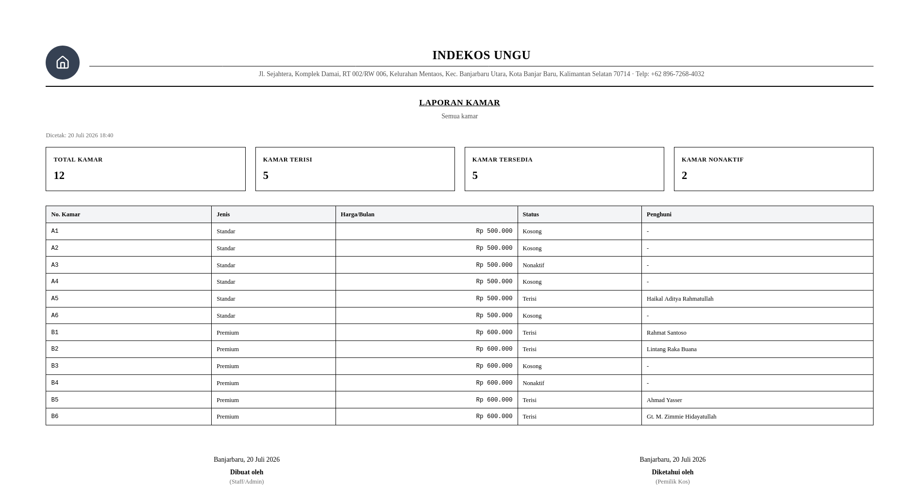

Laporan seluruh data unit kamar kos. Informasi mencakup nomor kamar, tipe kamar, harga sewa per bulan, status ketersediaan, serta nama penghuni yang menempati.

---

3. Laporan Komplain

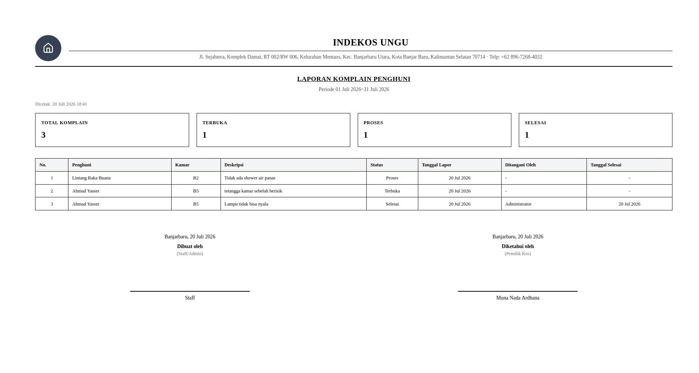

Laporan data pengaduan dari penghuni. Informasi mencakup nama penghuni, kamar terkait, deskripsi keluhan, status penanganan, tanggal pelaporan, petugas, dan tanggal selesai.

---

4. Laporan Transaksi

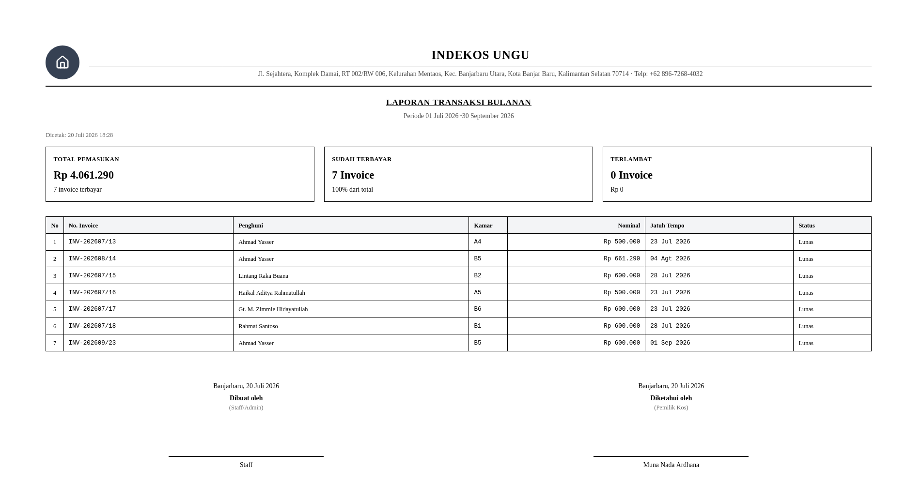

Laporan data transaksi keuangan pembayaran dalam periode tertentu. Informasi mencakup nomor *invoice*, nama penghuni, kamar, nominal, tanggal jatuh tempo, dan status kelunasan.

---

5. Laporan Notifikasi

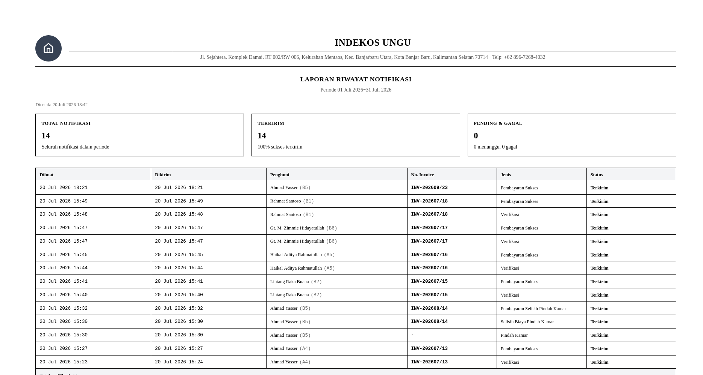

Laporan data pengiriman pesan notifikasi pengingat tagihan. Informasi mencakup tanggal dibuat dan dikirim, nama penghuni tujuan, nomor *invoice* terkait, jenis notifikasi, serta status pengiriman.

---

6. Laporan Log Chatbot

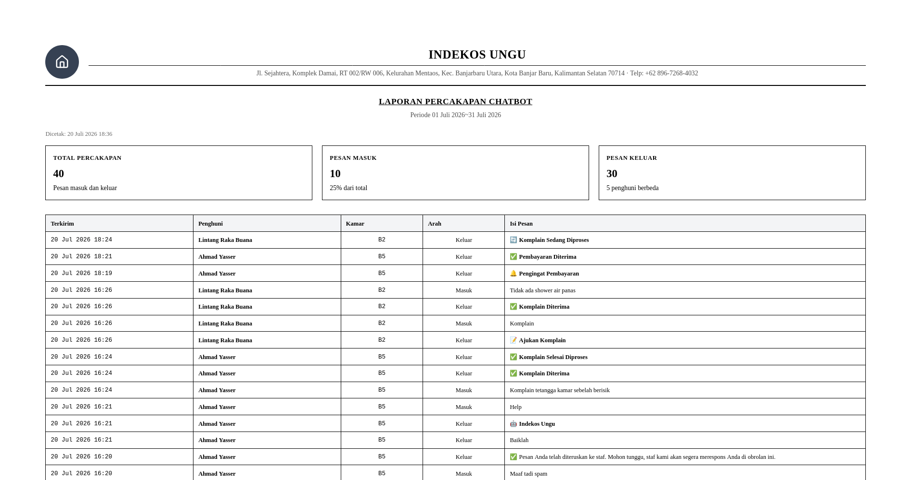

Laporan data percakapan *chatbot* dengan penghuni. Informasi mencakup waktu percakapan, nama penghuni, kamar, arah pesan, dan isi percakapan.

---

7. Laporan Audit Log

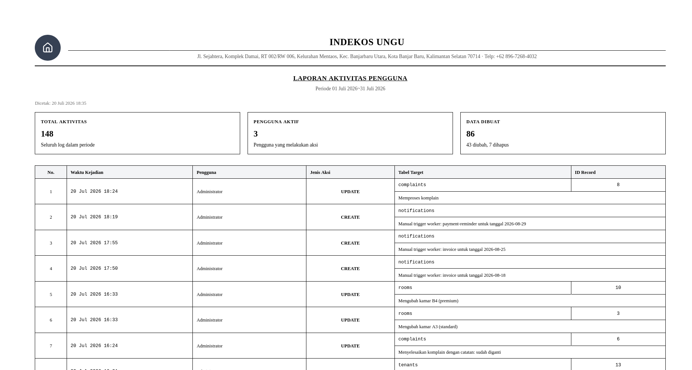

Laporan catatan aktivitas pengguna di dalam sistem. Informasi mencakup waktu kejadian, nama pengguna, jenis aksi, tabel data yang diubah, serta identitas *record* yang terpengaruh.

---

8. Invoice

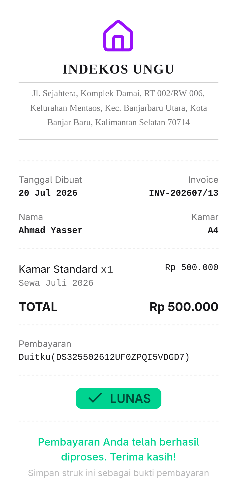

Halaman tagihan pembayaran yang dikirimkan kepada penghuni. Informasi mencakup nomor *invoice*, periode tagihan, rincian biaya sewa kamar, serta total tagihan yang harus dibayar.

---

9. Laporan Tagihan

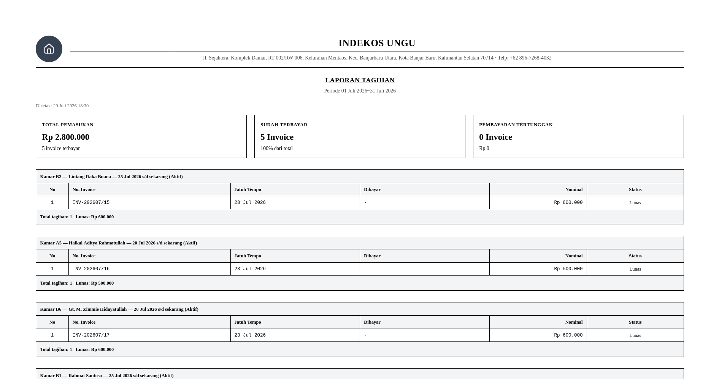

Laporan rekapitulasi tagihan per kontrak sewa penghuni dalam periode tertentu. Data dikelompokkan per kamar dan penghuni, mencakup nomor *invoice*, tanggal jatuh tempo, tanggal pembayaran, nominal, dan status kelunasan.

---

10. Laporan Tagihan Per Penghuni

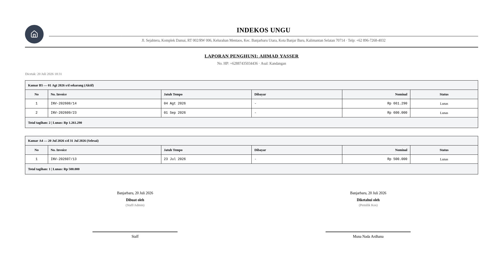

Laporan riwayat tagihan untuk satu penghuni tertentu. Data mencakup informasi penghuni (nama, telepon, asal), serta seluruh tagihan yang dikelompokkan berdasarkan periode kontrak sewa.

