# 📄 Deskripsi Antarmuka Sistem Manajemen Kos

## A. Antarmuka Masukan (Input)

Halaman yang digunakan untuk mengelola data sistem.

1. Dashboard

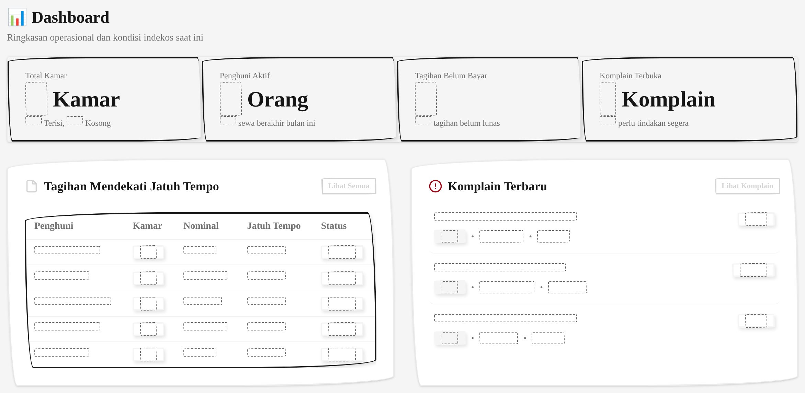

Ringkasan operasional kos: statistik kamar, penghuni aktif, tagihan belum bayar, dan komplain terbuka. Dilengkapi daftar tagihan mendekati jatuh tempo serta komplain terbaru.

2. Manajemen Akun

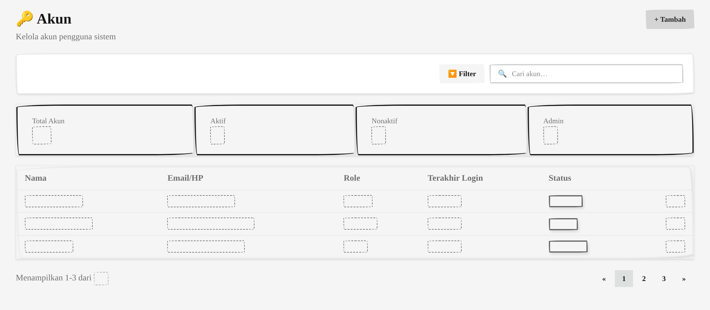

Mengelola pengguna sistem (admin, staff, pemilik). Menampilkan ringkasan jumlah akun, tabel nama pengguna dan role, serta fitur tambah akun.

3. Manajemen Kamar

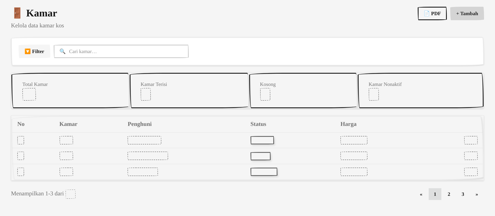

Mengelola data kamar kos. Menampilkan jenis kamar, harga, status ketersediaan, ringkasan kamar terisi, tersedia, dan nonaktif, serta tombol tambah kamar.

4. Manajemen Penghuni

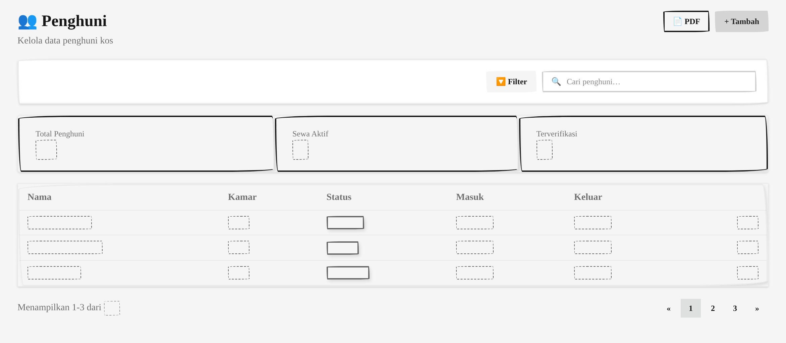

Mendaftarkan dan mengelola data penghuni. Disertai ringkasan total penghuni, sewa aktif, terverifikasi, serta tabel nama, kontak, kamar, periode sewa, dan status.

5. Manajemen Komplain

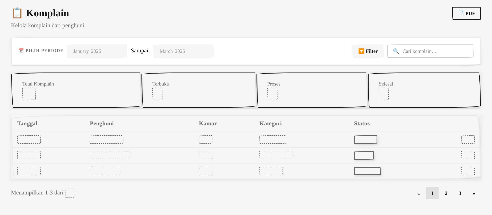

Mencatat dan memantau komplain penghuni. Setiap komplain memiliki status terbuka, diproses, atau selesai. Terdapat ringkasan jumlah komplain dan filter periode.

6. Transaksi

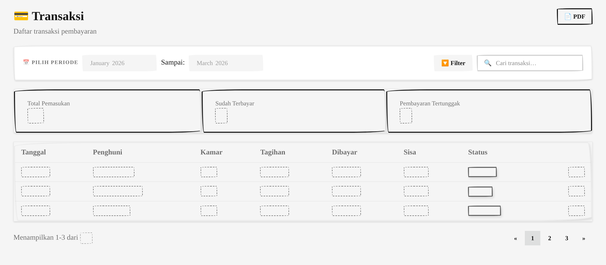

Daftar transaksi pembayaran penghuni. Menampilkan invoice, penghuni, nominal, jatuh tempo, status. Ringkasan total pemasukan, sudah terbayar, dan pembayaran tertunggak.

7. Notifikasi

Riwayat notifikasi yang dikirim ke penghuni. Mencakup waktu, penghuni tujuan, jenis, dan status terkirim. Ringkasan total notifikasi, terkirim, serta pending dan gagal.

8. Log Chatbot

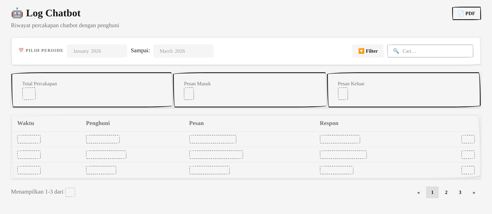

Riwayat percakapan chatbot dengan penghuni. Menampilkan waktu, penghuni, arah pesan (masuk/keluar), dan isi. Ringkasan total percakapan, pesan masuk, dan pesan keluar.

9. Audit Log

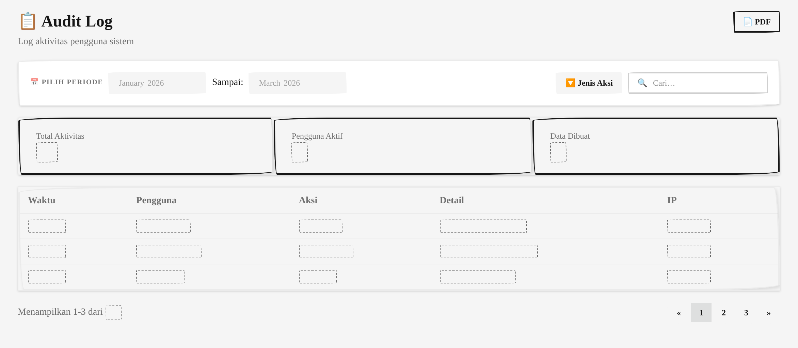

Mencatat aktivitas pengguna pada sistem. Setiap log mencakup waktu, pengguna, jenis aksi, dan tabel yang diubah. Ringkasan total aktivitas, pengguna aktif, dan data dibuat.

10. Login

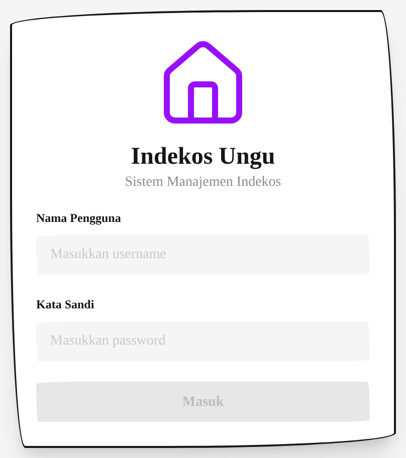

Form masuk ke sistem dengan nama pengguna dan kata sandi. Menampilkan ikon rumah dan nama Indekos Ungu sebagai identitas aplikasi.

## B. Antarmuka Keluaran (Output)

Halaman laporan cetak dengan kop surat, statistik, tabel data, dan tanda tangan.

1. Laporan Penghuni

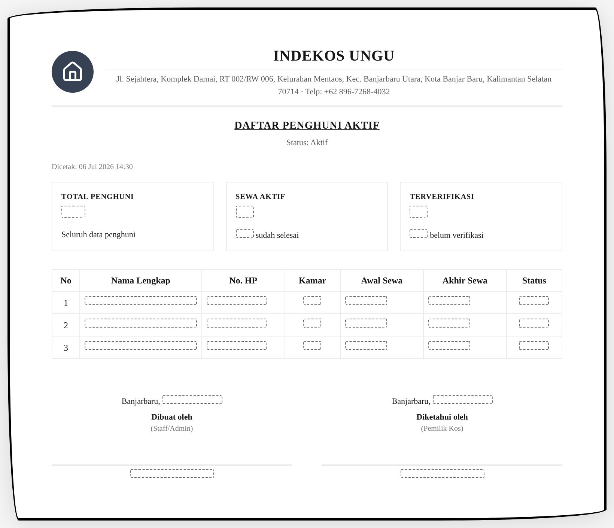

Laporan daftar penghuni aktif. Statistik total penghuni, sewa aktif, terverifikasi. Kolom: nama, nomor HP, kamar, awal/akhir sewa, status.

2. Laporan Kamar

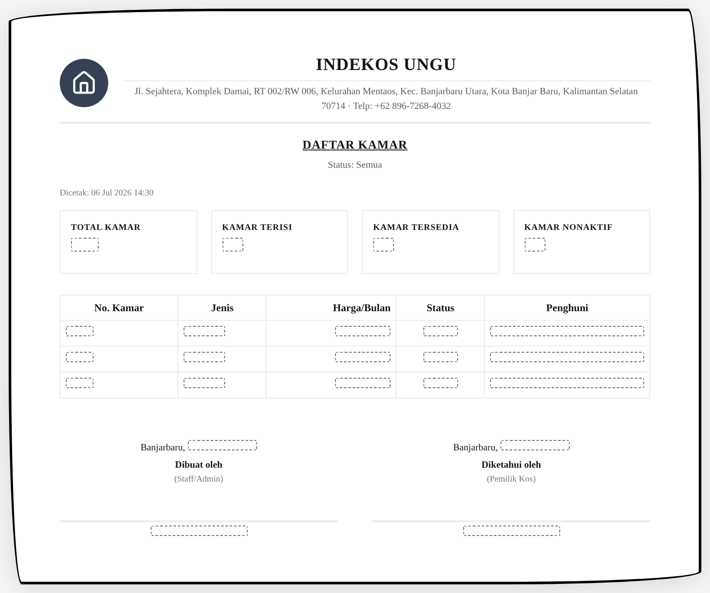

Laporan data kamar. Statistik total, terisi, tersedia, nonaktif. Kolom: nomor kamar, jenis, harga, status, penghuni.

3. Laporan Komplain

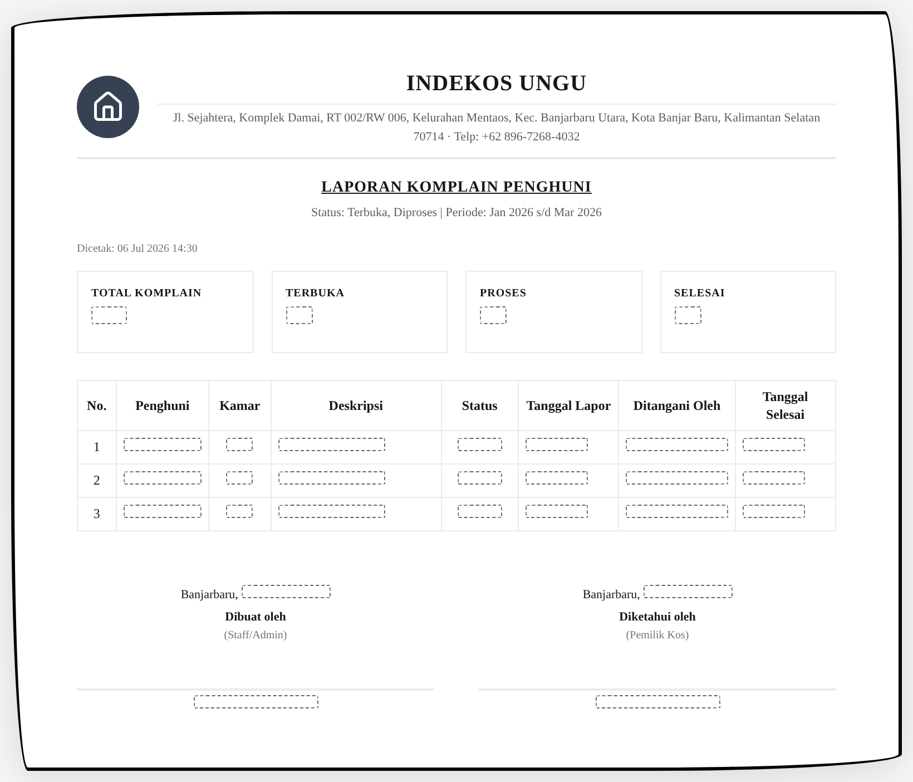

Laporan pengaduan penghuni. Statistik total komplain, terbuka, proses, selesai. Kolom: penghuni, kamar, deskripsi, status, tanggal lapor, ditangani, selesai.

4. Laporan Transaksi

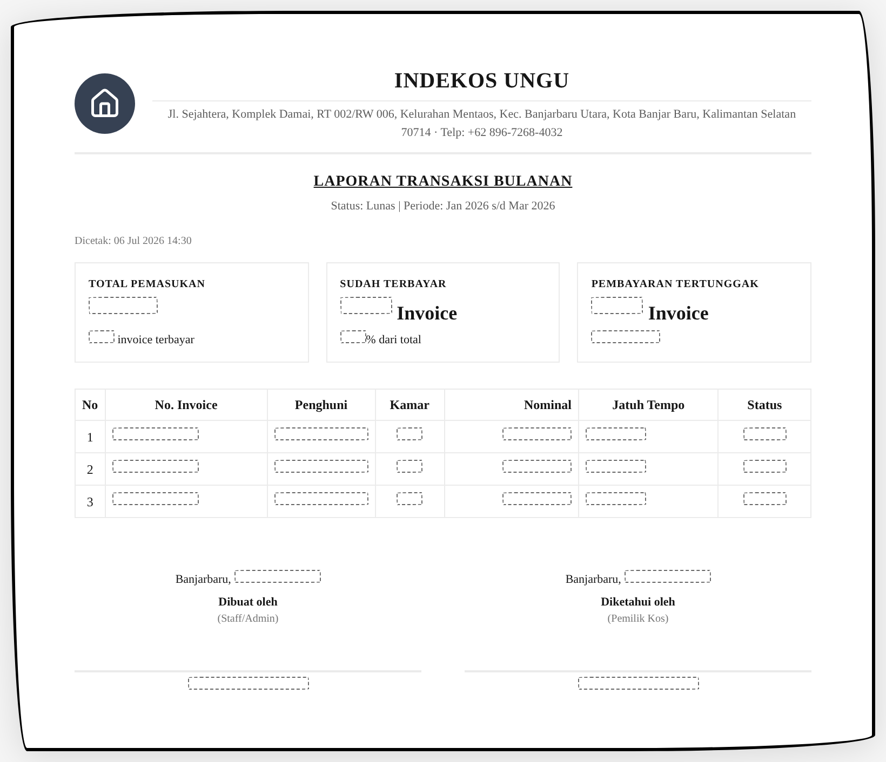

Laporan keuangan bulanan. Statistik total pemasukan, sudah terbayar, pembayaran tertunggak. Kolom: invoice, penghuni, kamar, nominal, jatuh tempo, status.

5. Laporan Notifikasi

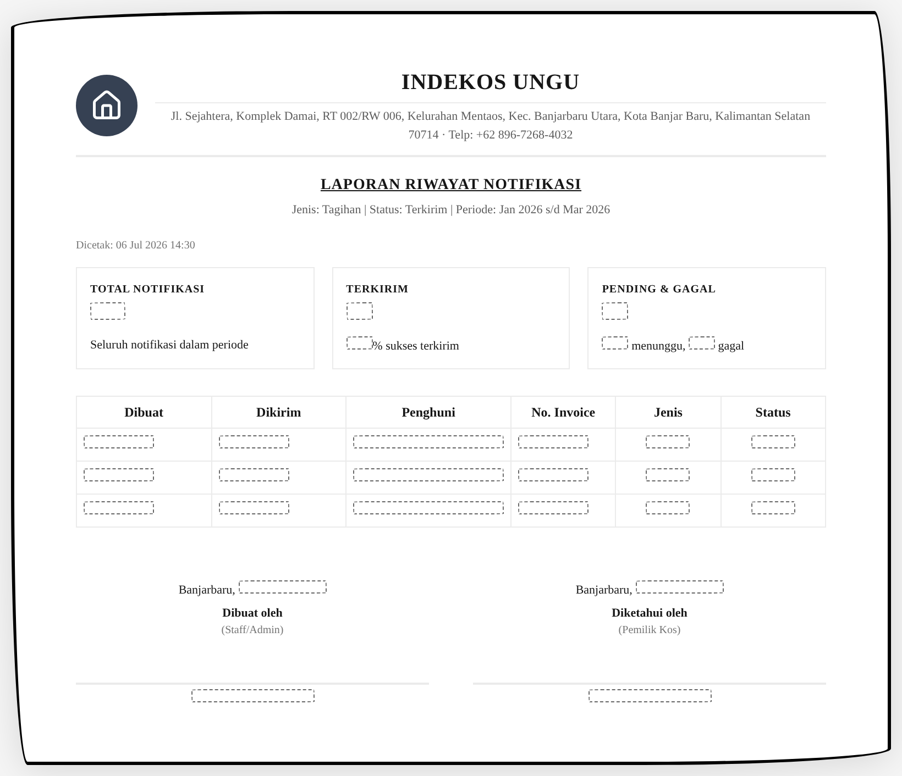

Ringkasan pengiriman notifikasi. Statistik total notifikasi, terkirim, pending dan gagal. Kolom: dibuat, dikirim, penghuni, invoice, jenis, status.

6. Log Chatbot

Riwayat percakapan chatbot. Statistik total percakapan, pesan masuk, pesan keluar. Kolom: waktu, penghuni, kamar, arah pesan, isi.

7. Audit Log

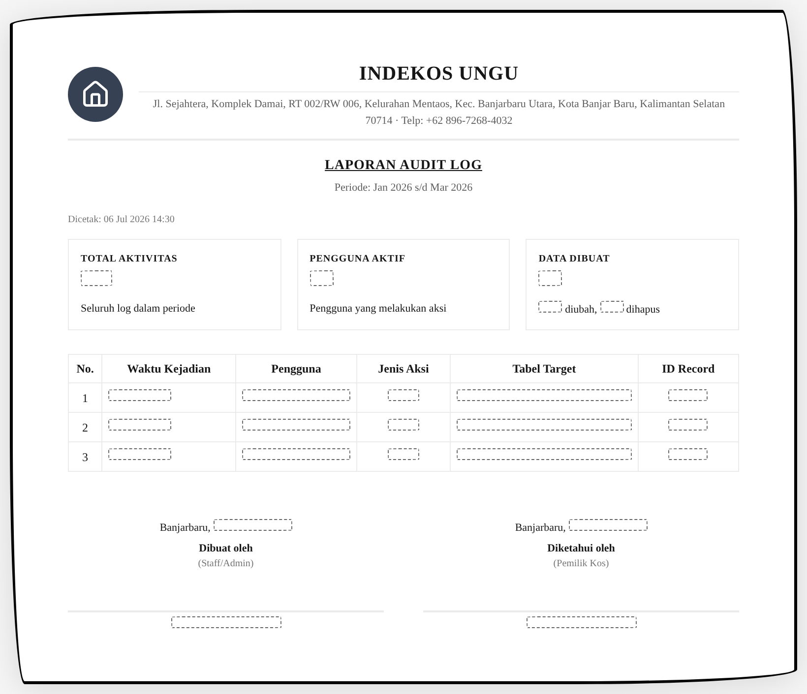

Laporan aktivitas sistem. Statistik total aktivitas, pengguna aktif, data dibuat. Kolom: waktu, pengguna, jenis aksi, tabel target, id record.

8. Invoice

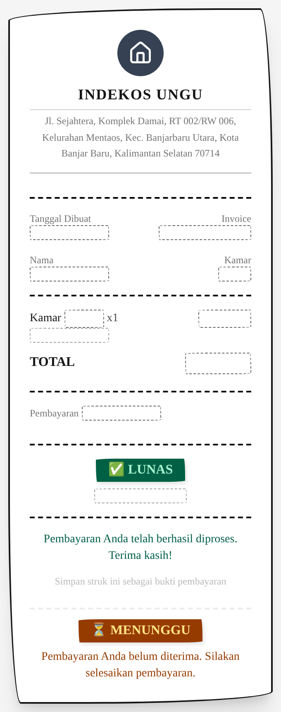

Tagihan pembayaran penghuni. Mencantumkan nomor invoice, periode tagihan, rincian biaya (sewa, listrik, air, kebersihan), total, dan instruksi pembayaran.

