# 📄 Deskripsi Antarmuka Sistem Manajemen Kos

## A. Antarmuka Masukan (Input)

Halaman yang digunakan pengguna untuk memasukkan dan mengelola data sistem.

1. Halaman Login

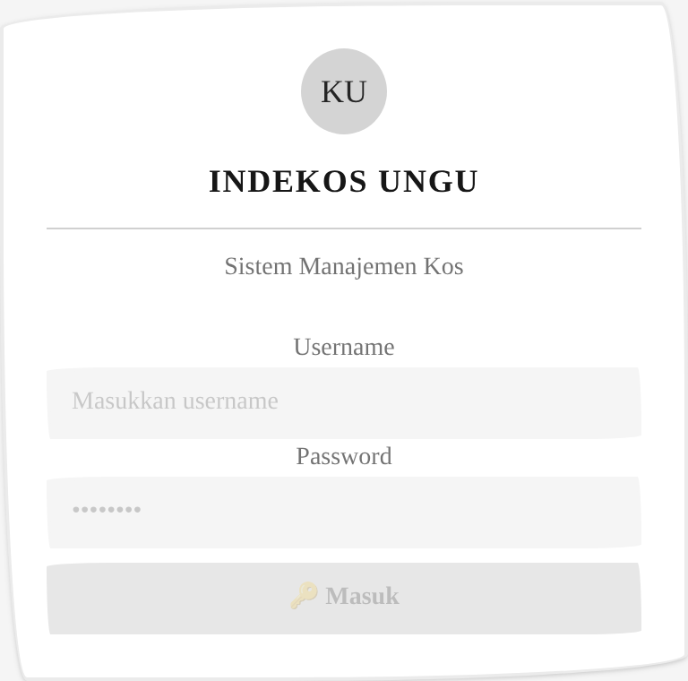

Form masuk ke sistem dengan username dan password. Menampilkan logo Indekos Ungu sebagai identitas.

2. Halaman Dashboard

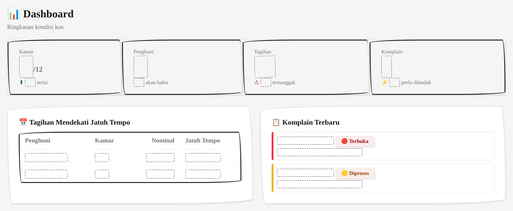

Ringkasan kondisi kos melalui kartu statistik (kamar terisi, penghuni, tagihan, komplain) serta daftar tagihan jatuh tempo dan komplain terbaru untuk pemantauan cepat.

3. Halaman Manajemen Penghuni

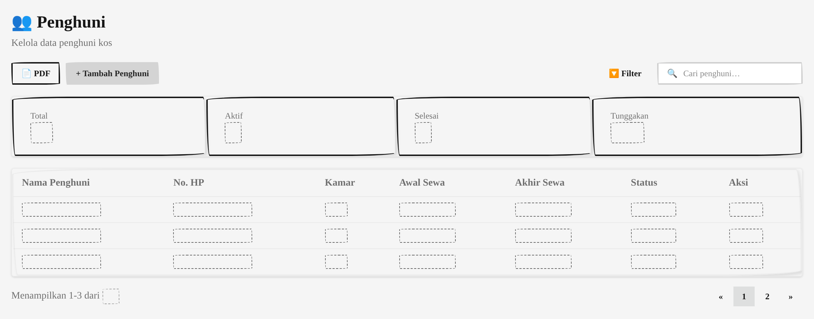

Mendaftarkan dan mengelola data penghuni kos. Dilengkapi pencarian, ringkasan jumlah penghuni (aktif/selesai/tunggakan), serta tabel berisi nama, kontak, kamar, periode sewa, dan status.

4. Halaman Manajemen Kamar

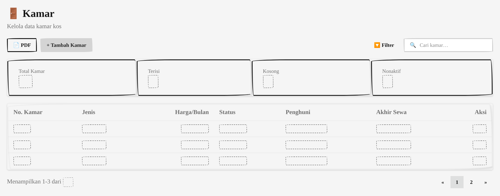

Mengelola data kamar kos. Menampilkan jenis kamar, harga sewa, status ketersediaan, ringkasan kamar terisi dan kosong, serta tombol tambah kamar baru.

5. Halaman Manajemen Akun

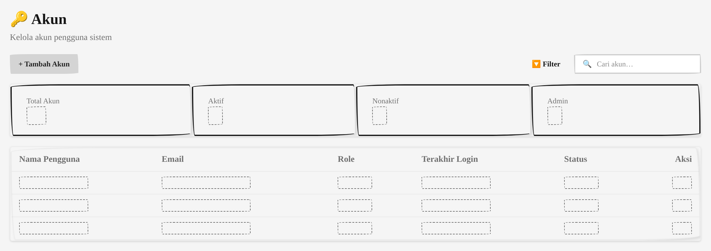

Mengelola pengguna sistem seperti admin, staff, dan pemilik kos. Terdapat ringkasan jumlah akun berdasarkan status dan tabel nama pengguna, email, role.

6. Halaman Komplain

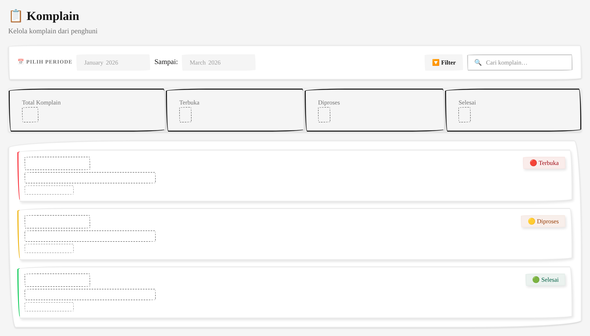

Mencatat dan memantau komplain dari penghuni. Setiap komplain ditampilkan dalam kartu dengan status terbuka, diproses, atau selesai. Terdapat filter periode dan ringkasan jumlah komplain.

7. Halaman Log Chatbot

Riwayat percakapan antara chatbot dan penghuni. Menampilkan waktu, nama penghuni, dan arah pesan (masuk/keluar). Dilengkapi filter periode dan ringkasan statistik percakapan.

8. Halaman Audit Log

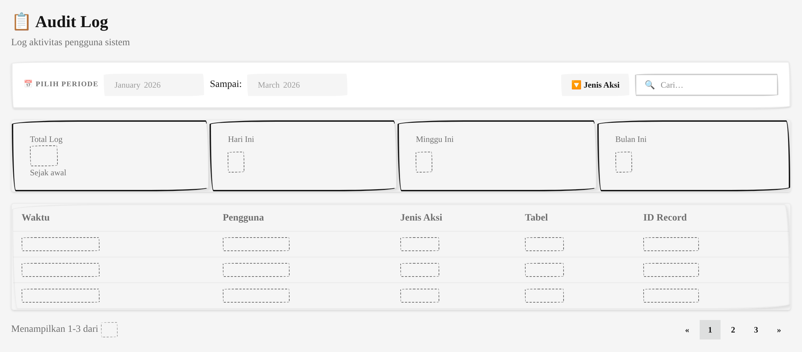

Mencatat aktivitas pengguna di dalam sistem. Setiap log mencakup waktu, pengguna, jenis aksi, dan tabel yang diubah. Terdapat filter berdasarkan periode dan jenis aksi.

9. Halaman Transaksi

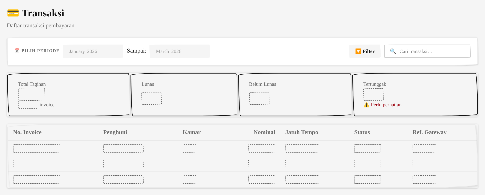

Daftar transaksi pembayaran penghuni. Menampilkan nomor invoice, penghuni, nominal, jatuh tempo, status pembayaran, dan referensi gateway. Ringkasan statistik total tagihan, lunas, dan tertunggak.

10. Halaman Notifikasi

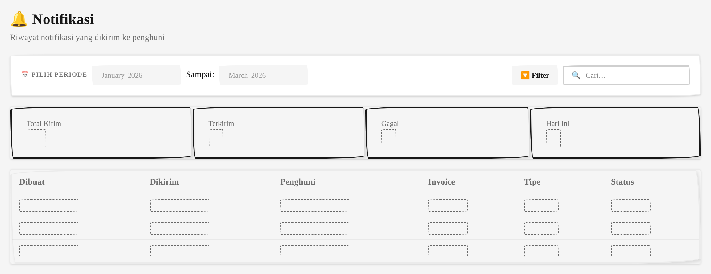

Riwayat notifikasi yang telah dikirim ke penghuni. Mencakup waktu pengiriman, penghuni tujuan, jenis notifikasi, dan status terkirim atau gagal. Dilengkapi filter periode.

## B. Antarmuka Keluaran (Output)

Halaman yang menyajikan data dalam bentuk cetak atau laporan.

1. Laporan Transaksi Bulanan

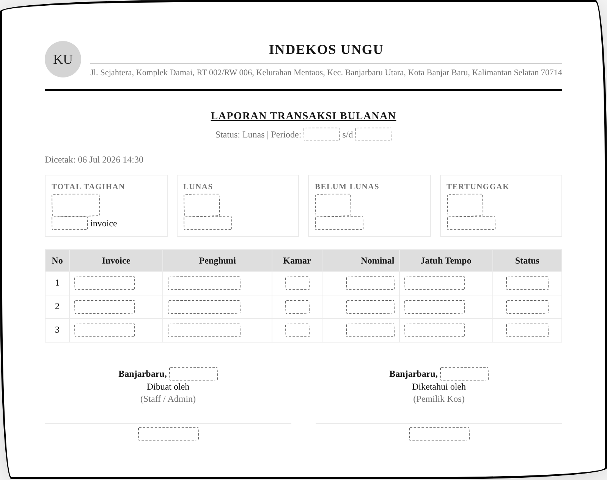

Laporan keuangan bulanan mencakup total tagihan, jumlah invoice lunas, belum lunas, dan tertunggak. Dilengkapi kop surat dan tanda tangan.

2. Laporan Riwayat Notifikasi

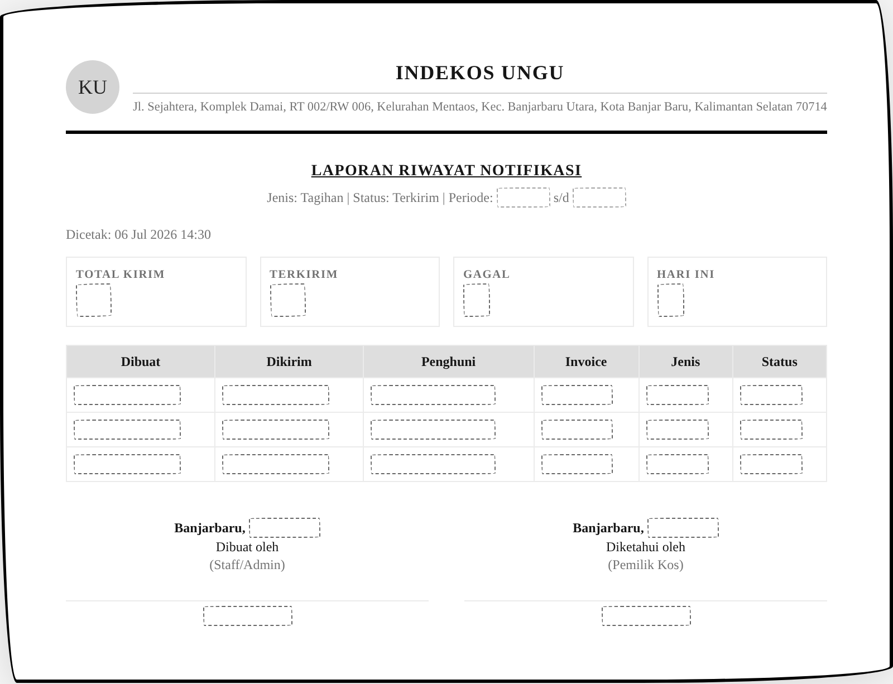

Ringkasan pengiriman notifikasi dalam periode tertentu. Menampilkan total kirim, terkirim, gagal, dan rincian per penghuni.

3. Daftar Penghuni Aktif

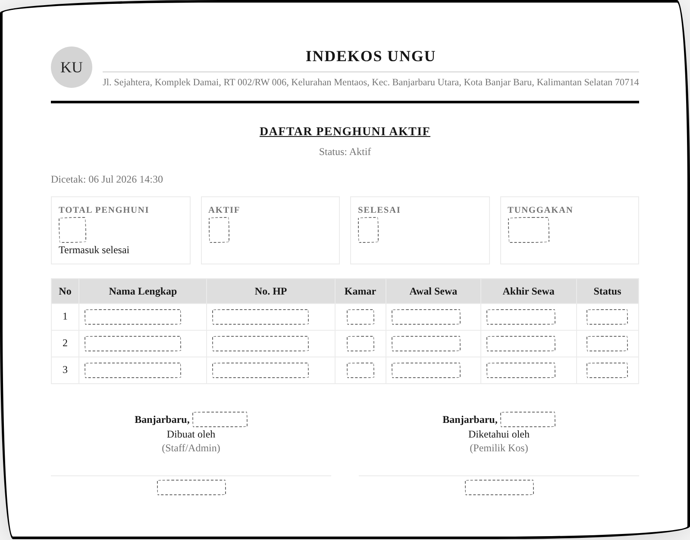

Daftar penghuni yang masih aktif beserta nomor kamar, kontak, dan periode sewa. Digunakan untuk pendataan dan arsip.

4. Rekap Status Kamar

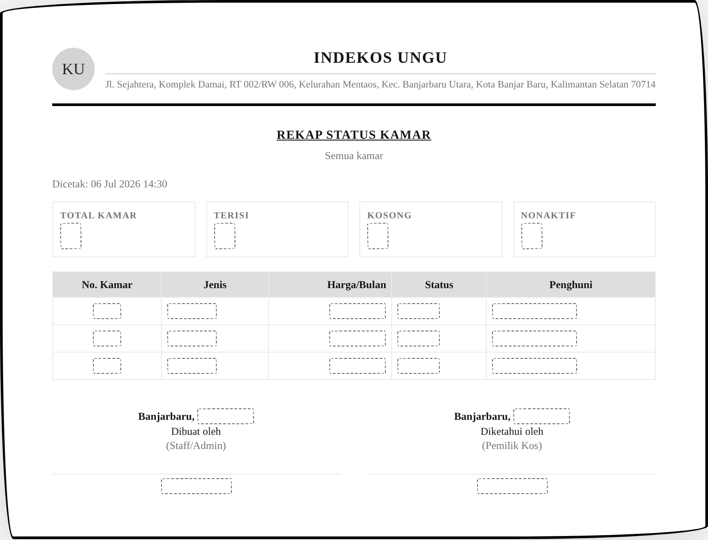

Rekapitulasi seluruh kamar kos meliputi nomor kamar, jenis, harga sewa, status terisi atau kosong, dan penghuni saat ini.

5. Laporan Komplain Penghuni

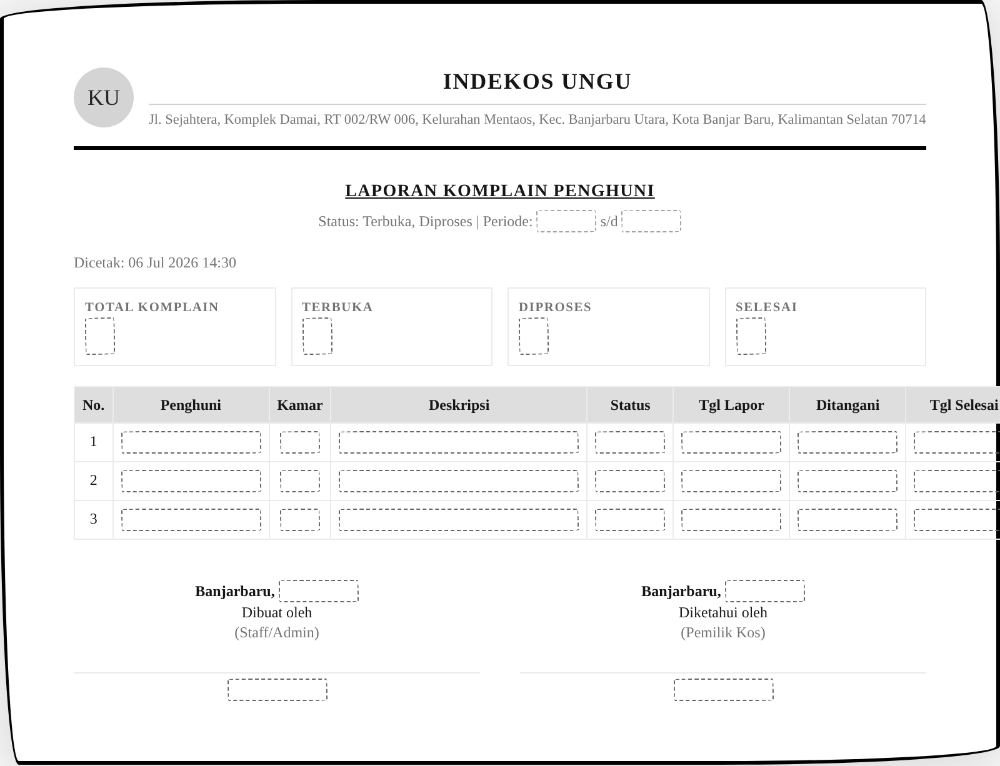

Laporan komplain yang masuk dari penghuni dalam periode tertentu. Mencakup deskripsi, status penanganan, dan tanggal penyelesaian.

6. Laporan Percakapan Chatbot

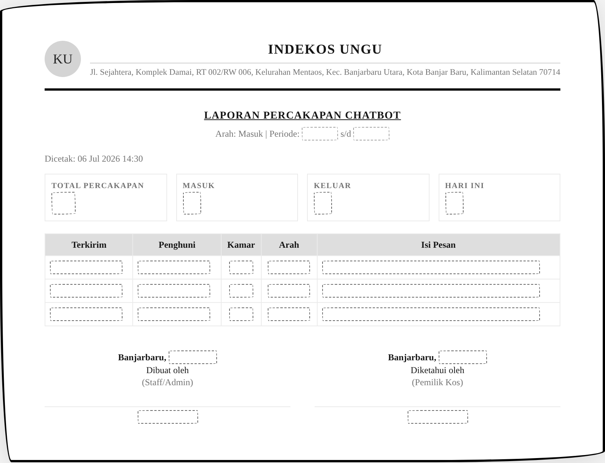

Riwayat percakapan chatbot dengan penghuni dalam format cetak. Menampilkan waktu, penghuni, arah pesan, dan isi pesan.

7. Laporan Aktivitas Pengguna

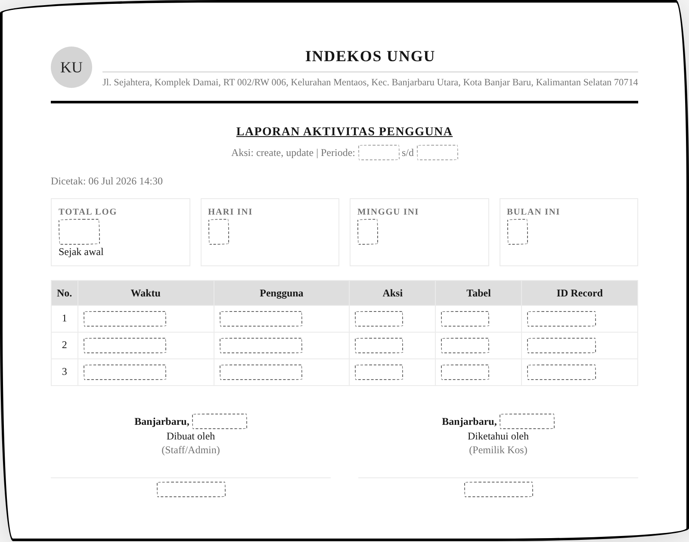

Log aktivitas pengguna sistem dalam periode tertentu. Mencakup waktu, pengguna, jenis aksi, dan objek yang diubah.

8. Invoice / Struk Pembayaran

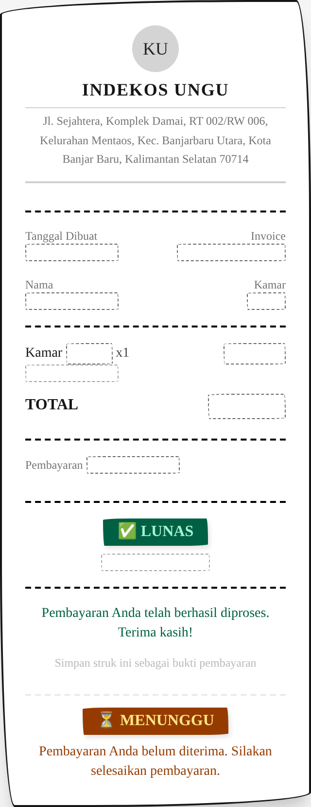

Struk digital pembayaran sewa kos. Menampilkan informasi invoice, rincian biaya, status pembayaran, dan kop surat Indekos Ungu. Tersedia dua varian status: lunas dan menunggu.

