# 📄 Deskripsi Antarmuka Sistem Manajemen Kos

## 🧾 A. Antarmuka Masukan (Input)

Antarmuka masukan dirancang agar mudah digunakan dan meminimalkan kesalahan. Setiap halaman disusun berdasarkan kebutuhan sistem agar data yang dimasukkan sesuai dengan struktur database.

1. Halaman Login

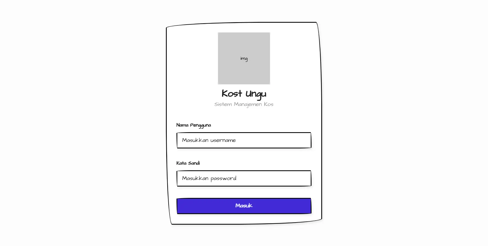

Halaman login digunakan untuk masuk ke dalam sistem. Terdapat dua input utama yaitu username dan password, serta tombol masuk. Pengguna harus mengisi data dengan benar agar dapat mengakses sistem.

---

2. Halaman Dashboard

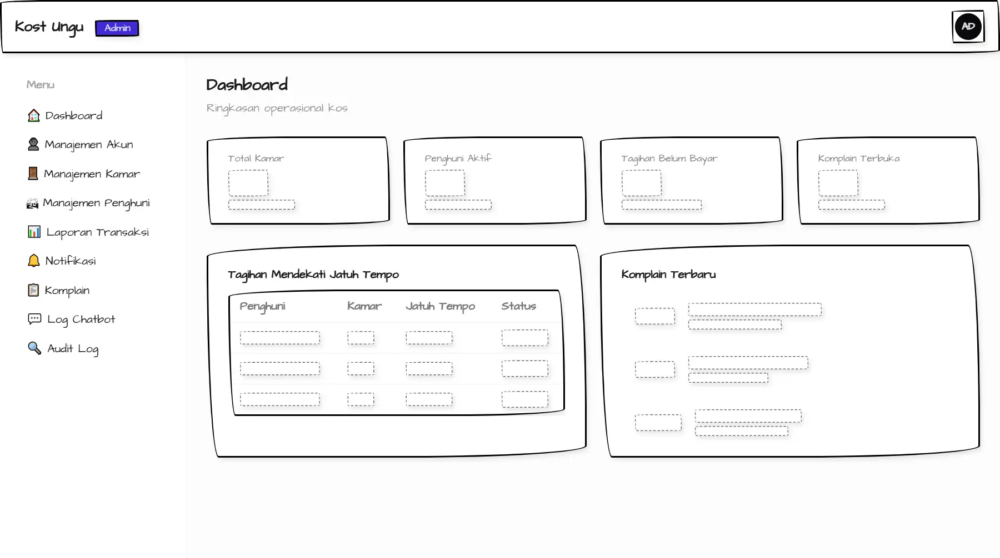

Halaman dashboard menampilkan ringkasan kondisi sistem seperti jumlah kamar, penghuni aktif, tagihan, dan komplain. Selain itu, terdapat informasi tambahan seperti tagihan yang mendekati jatuh tempo dan komplain terbaru.

---

3. Halaman Manajemen Akun

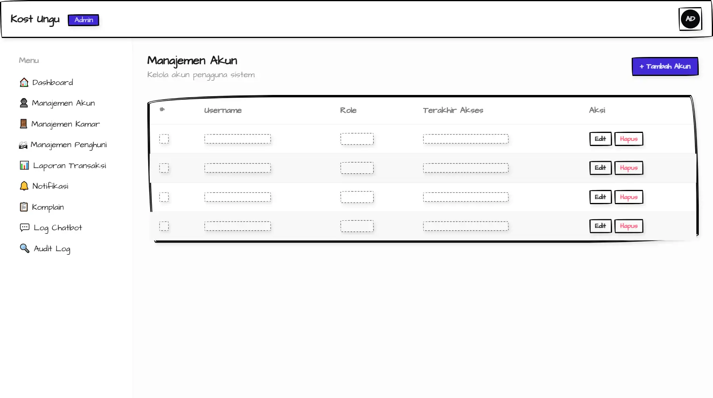

Halaman ini menampilkan daftar akun pengguna dalam bentuk tabel. Informasi yang ditampilkan meliputi username, role, dan aktivitas terakhir. Pengguna dapat mengelola data akun melalui halaman ini.

---

4. Halaman Manajemen Kamar

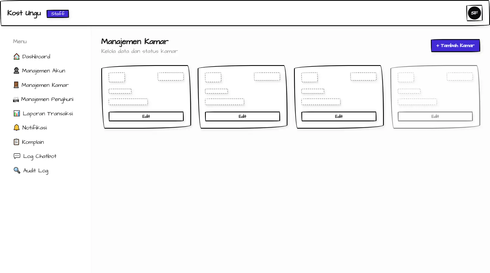

Halaman ini menampilkan data kamar dalam bentuk kartu. Setiap kamar memiliki informasi seperti nomor kamar, jenis kamar, harga, dan status. Halaman ini digunakan untuk melihat dan mengelola kamar.

---

5. Halaman Manajemen Penghuni

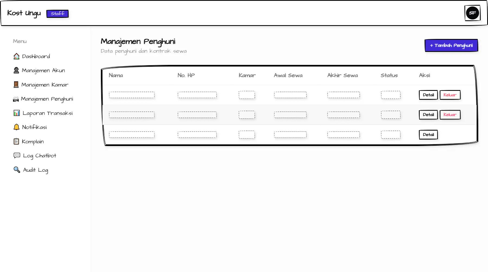

Halaman ini berisi daftar penghuni dalam bentuk tabel. Data yang ditampilkan meliputi nama, nomor HP, kamar, masa sewa, dan status. Digunakan untuk mengelola data penghuni kos.

---

6. Halaman Transaksi

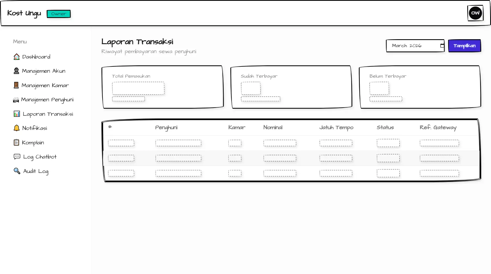

Halaman ini digunakan untuk melihat data transaksi pembayaran. Terdapat filter periode untuk menampilkan data sesuai waktu tertentu, serta tabel berisi detail transaksi.

---

7. Halaman Notifikasi

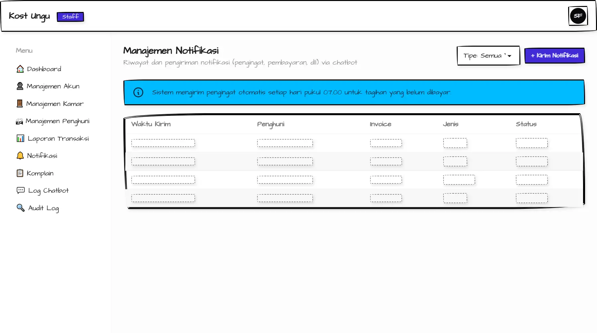

Halaman ini menampilkan daftar notifikasi (pengingat, pembayaran sukses, dan pesan kustom). Digunakan untuk mengelola komunikasi dengan penghuni melalui chatbot.

---

8. Halaman Komplain

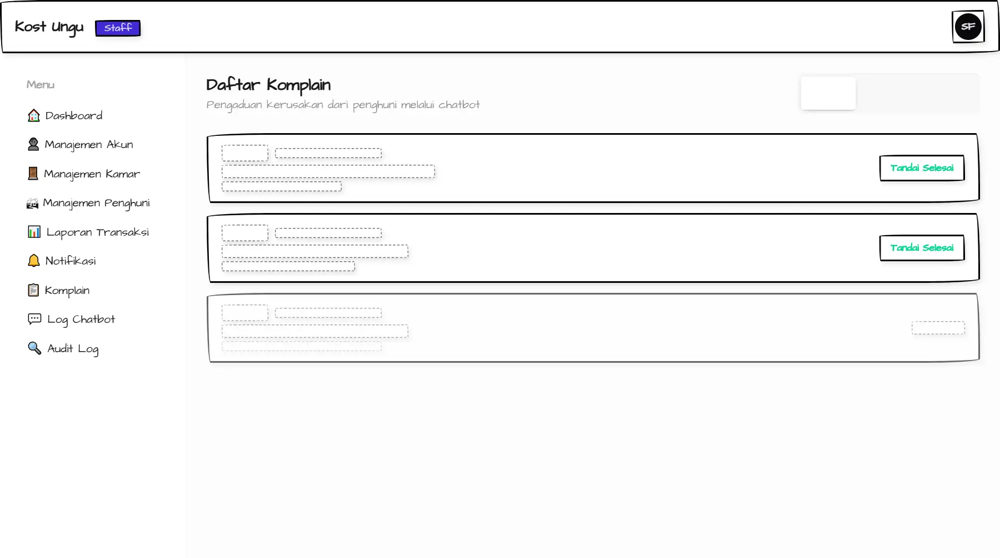

Halaman ini menampilkan daftar komplain dari penghuni. Informasi yang ditampilkan meliputi isi komplain dan status penanganannya.

---

9. Halaman Log Chatbot

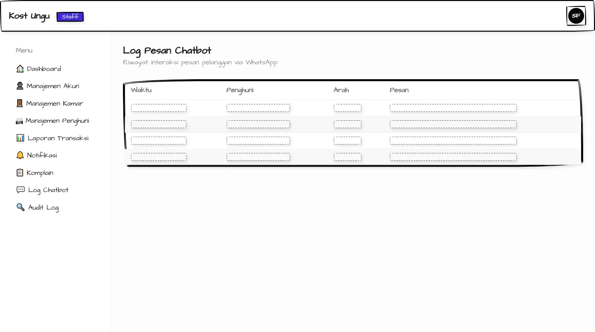

Halaman ini menampilkan riwayat percakapan antara pengguna dan chatbot. Data ditampilkan dalam bentuk daftar pesan yang dapat digunakan untuk monitoring interaksi.

---

10. Halaman Audit Log

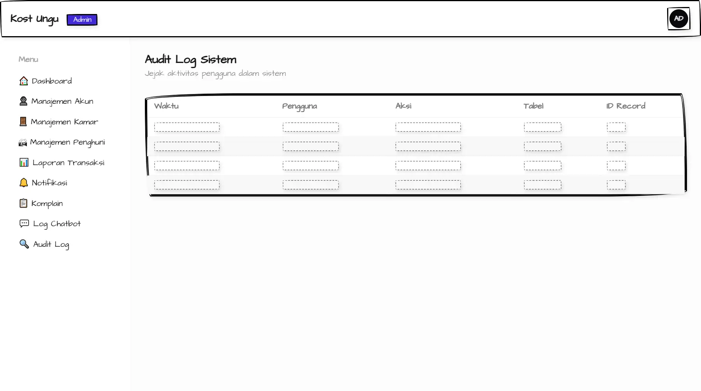

Halaman ini berisi riwayat aktivitas pengguna dalam sistem. Informasi yang ditampilkan meliputi waktu, aksi, dan data yang terlibat.

---

## 📊 B. Antarmuka Keluaran (Output)

Antarmuka keluaran menampilkan informasi dalam bentuk laporan dan tampilan data yang mudah dibaca. Informasi ditampilkan sesuai dengan data yang tersimpan dalam sistem untuk mendukung pemantauan dan pengambilan keputusan.

1. Laporan Transaksi

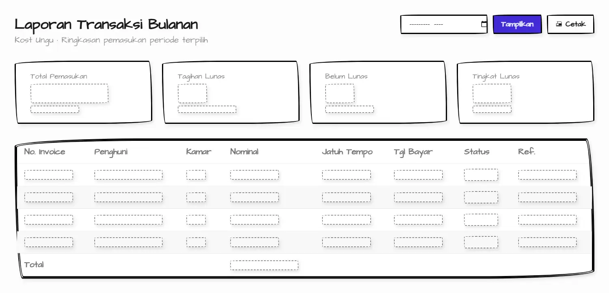

Rancangan keluaran ini menampilkan ringkasan transaksi pembayaran kos dalam periode tertentu yang mencakup total pemasukan, jumlah tagihan lunas dan belum lunas, serta tingkat pelunasan, disertai tabel detail berisi nomor invoice, nama penghuni, kamar, nominal, tanggal jatuh tempo, tanggal bayar, status, dan referensi transaksi yang dapat dicetak sebagai laporan administrasi.

---

2. Struk Invoice

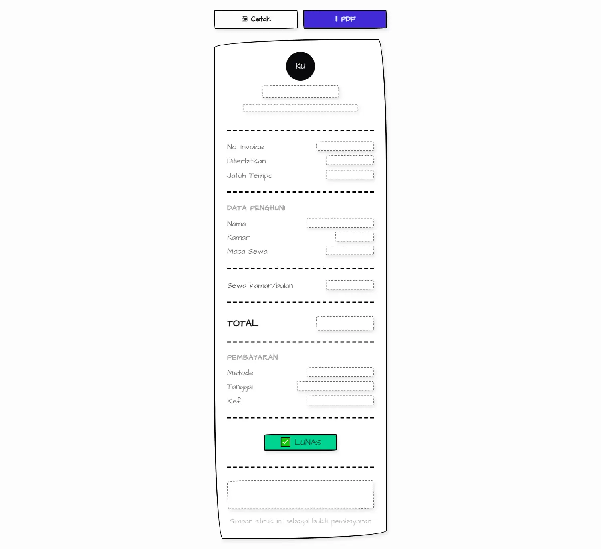

Rancangan keluaran ini berupa bukti pembayaran digital yang menampilkan informasi invoice seperti nomor, tanggal terbit, jatuh tempo, data penghuni, rincian biaya, total pembayaran, metode pembayaran, tanggal transaksi, serta status pembayaran sehingga dapat digunakan sebagai bukti sah pembayaran.

---

3. Laporan Audit Log

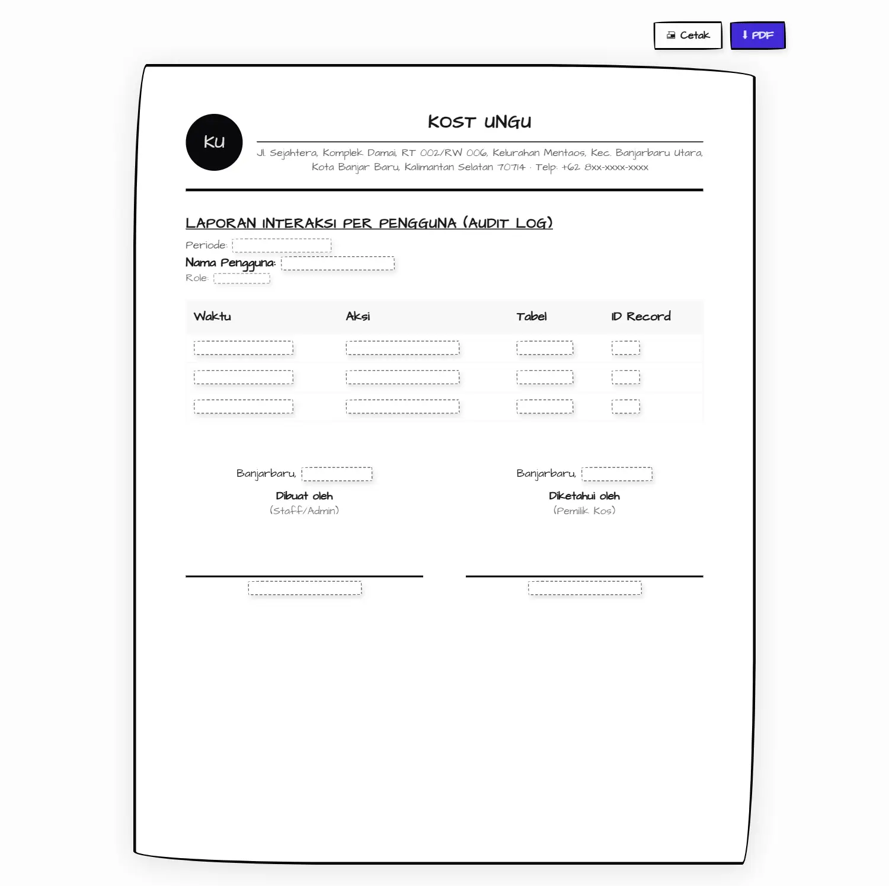

Rancangan keluaran ini menyajikan data aktivitas pengguna dalam sistem berdasarkan periode tertentu yang mencakup nama pengguna, peran, serta tabel log berisi waktu aktivitas, jenis aksi, nama tabel yang diakses, dan ID data untuk keperluan monitoring dan keamanan sistem.

---

4. Laporan Interaksi Chatbot

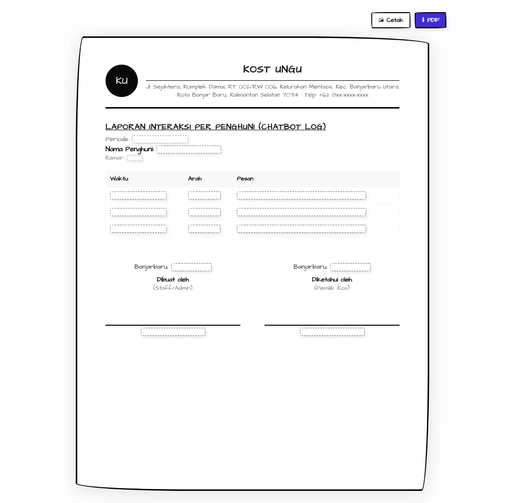

Rancangan keluaran ini menampilkan riwayat komunikasi antara penghuni dan chatbot dalam periode tertentu yang mencakup identitas penghuni serta tabel berisi waktu pesan, arah pesan (masuk atau keluar), dan isi pesan untuk evaluasi layanan komunikasi.

---

5. Daftar Penghuni

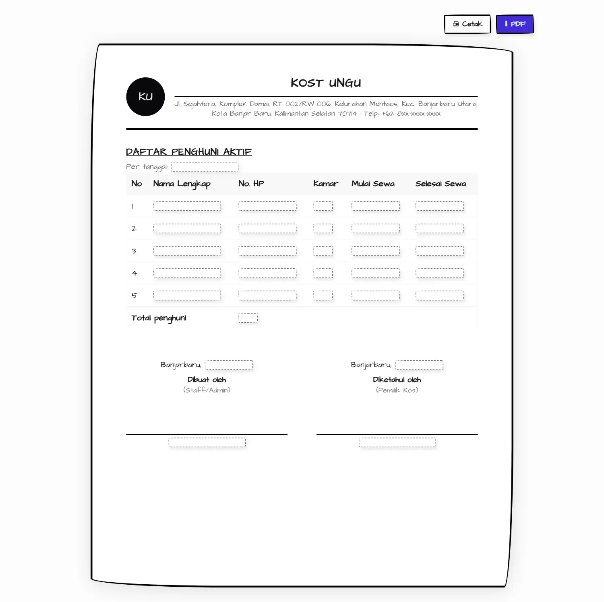

Rancangan keluaran ini berisi daftar penghuni yang masih aktif menempati kamar kos dengan informasi seperti nama lengkap, nomor telepon, kamar, tanggal mulai dan selesai sewa, dilengkapi total penghuni serta area tanda tangan sebagai validasi laporan.

---

6. Rekap Kamar

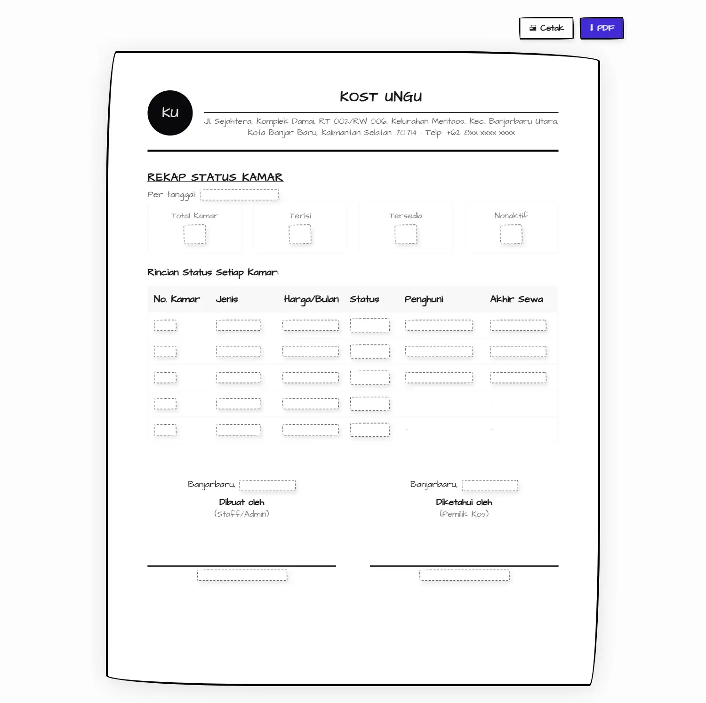

Rancangan keluaran ini menyajikan ringkasan kondisi kamar kos yang mencakup jumlah total kamar, kamar terisi, tersedia, dan nonaktif, serta tabel detail setiap kamar berisi nomor kamar, jenis, harga, status, penghuni, dan akhir masa sewa untuk memantau ketersediaan kamar.

---

7. Laporan Komplain

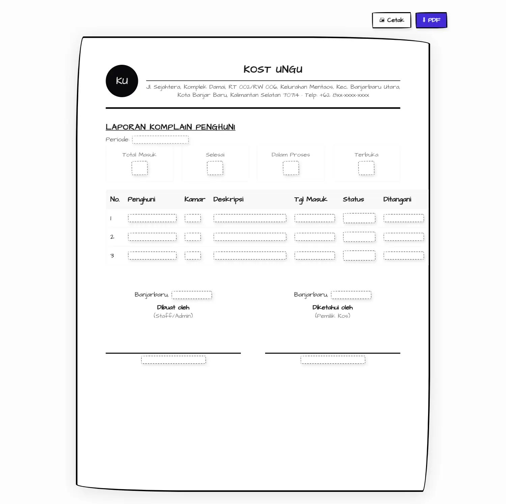

Rancangan keluaran ini menampilkan data komplain penghuni dalam periode tertentu yang mencakup jumlah komplain berdasarkan status serta tabel detail berisi nama penghuni, kamar, deskripsi masalah, tanggal pengajuan, status, dan pihak yang menangani untuk evaluasi pelayanan.

---

8. Laporan Pengingat

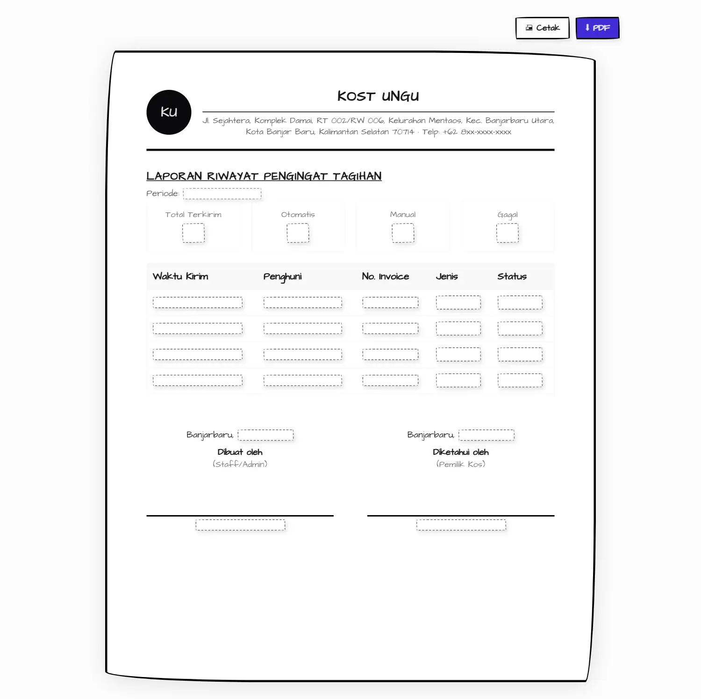

Rancangan keluaran ini berisi riwayat pengiriman notifikasi tagihan kepada penghuni yang mencakup jumlah notifikasi terkirim, otomatis, manual, dan gagal, serta tabel detail berisi waktu kirim, penghuni, nomor invoice, jenis pengingat, dan status pengiriman.

---

9. Rekap Tagihan

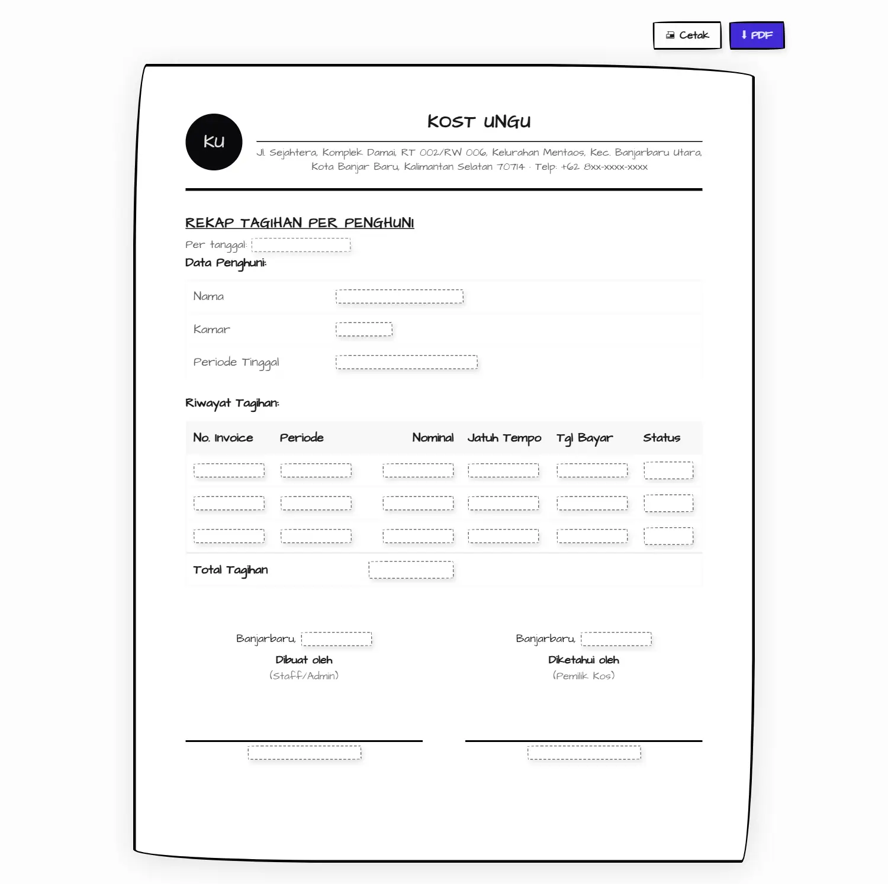

Rancangan keluaran ini menyajikan riwayat tagihan tiap penghuni yang mencakup identitas penghuni serta tabel berisi nomor invoice, periode, nominal, jatuh tempo, tanggal bayar, dan status, dilengkapi total keseluruhan tagihan sebagai ringkasan.

